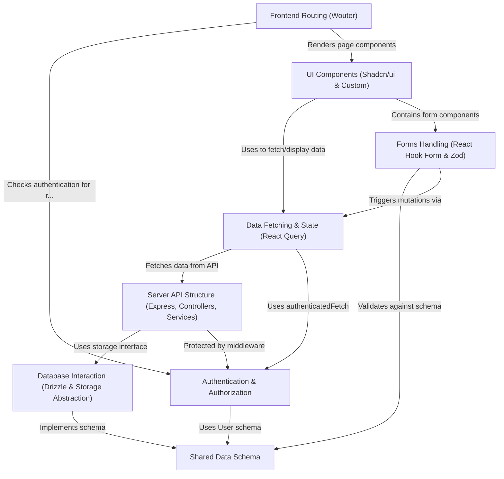

# Tutorial: Project-Finance-Tracker

**Project-Finance-Tracker** is a *web application* designed to help manage the finances of projects.
Users can track **projects**, their associated **expenses**, manage **clients**, and view **analytics**.
It features *user authentication* to secure access and provides a dashboard for a quick overview.

**Source Repository:** [https://github.com/Navdeep-Davang/Project-Finance-Tracker.git](https://github.com/Navdeep-Davang/Project-Finance-Tracker.git)

## Chapters

1. [Shared Data Schema
](01_shared_data_schema_.md)
2. [Authentication & Authorization
](02_authentication___authorization_.md)
3. [Server API Structure (Express, Controllers, Services)
](03_server_api_structure__express__controllers__services__.md)
4. [Database Interaction (Drizzle & Storage Abstraction)
](04_database_interaction__drizzle___storage_abstraction__.md)
5. [Frontend Routing (Wouter)
](05_frontend_routing__wouter__.md)
6. [Data Fetching & State (React Query)
](06_data_fetching___state__react_query__.md)
7. [UI Components (Shadcn/ui & Custom)
](07_ui_components__shadcn_ui___custom__.md)
8. [Forms Handling (React Hook Form & Zod)
](08_forms_handling__react_hook_form___zod__.md)

---

Generated by [AI Codebase Knowledge Builder](https://github.com/The-Pocket/Tutorial-Codebase-Knowledge)