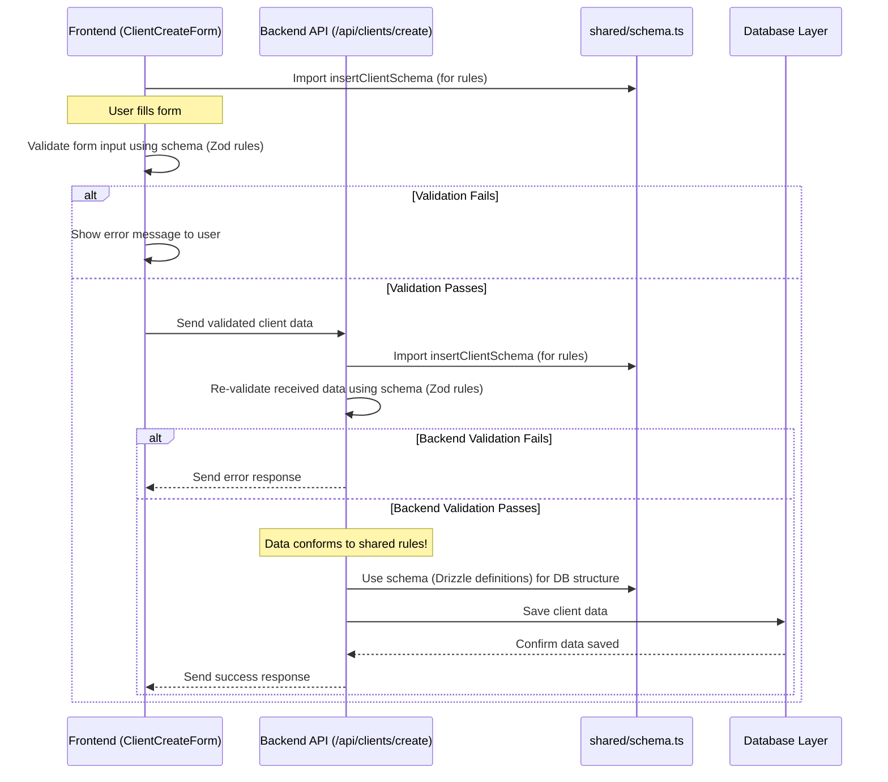

# Chapter 1: Shared Data Schema

Welcome to the Project-Finance-Tracker tutorial! We're excited to have you here. This project helps manage finances for various projects, tracking clients, expenses, and more.

In this first chapter, we'll explore a foundational concept: the **Shared Data Schema**.

## What Problem Does This Solve? The Blueprint Analogy

Imagine you're building a house. You have an architect, a plumber, an electrician, and carpenters all working together. What's the *one thing* they all absolutely need to agree on? The **blueprint**!

Without a single, official blueprint:
*   The plumber might put pipes where the electrician plans to run wires.
*   The carpenter might build a wall that blocks a planned window.
*   Chaos ensues!

In software development, especially with a frontend (what you see in the browser) and a backend (the server doing the heavy lifting), we face a similar challenge with **data**. How do we define what a "User" looks like? What information is required for a "Project"? What are the rules for entering an "Expense"?

If the frontend expects to send a client's `email_address`, but the backend expects `clientEmail`, things break. If the frontend allows a project budget of $0, but the backend requires it to be positive, we get errors.

The **Shared Data Schema** is our project's official "blueprint" for data. It's the single place where we define the structure and rules for all the important pieces of information (like Users, Projects, Clients, Expenses) used throughout our application.

**Our Goal (Use Case):** Let's say we want to add a *new client* to our finance tracker. We need a form in the frontend for the user to enter the client's details (name, contact person, email, phone). When the user submits the form, the backend needs to receive this data, check if it's valid, and save it to the database. The Shared Data Schema ensures the frontend form and the backend server *agree* on exactly what information makes up a "Client" and what rules that information must follow.

## Key Concepts

Let's break down what makes up our Shared Data Schema:

1.  **Single Source of Truth:** All definitions for our data structures live in *one* central file: `shared/schema.ts`. If we need to know what fields a `User` has or add a new field to `Project`, we *only* change this file. This prevents confusion and ensures everyone is working with the same definitions.

2.  **Drizzle ORM Syntax (The Structure):** We use a tool called "Drizzle ORM" to define the *structure* of our data. Think of it like defining the columns in a spreadsheet or the fields on a paper form. It specifies the names and types of data (e.g., `name` is text, `budget` is a number, `startDate` is a date).

    ```typescript
    // Example snippet from shared/schema.ts (Simplified)
    import { pgTable, text, serial, integer } from "drizzle-orm/pg-core";
    import { users } from "./users"; // Assuming users table is defined elsewhere

    export const clients = pgTable("clients", {
      id: serial("id").primaryKey(), // Unique ID number
      name: text("name").notNull(),   // Client's name (required text)
      contactPerson: text("contact_person").notNull(), // Contact name (required text)
      contactEmail: text("contact_email").notNull(), // Contact email (required text)
      // ... other fields like phone number
      createdById: integer("created_by_id").notNull().references(() => users.id), // Link to the user who created it
    });
    ```
    This code defines a "table" named `clients` with specific fields like `id`, `name`, etc. We'll see how this relates to the actual database in [Chapter 4: Database Interaction (Drizzle & Storage Abstraction)](04_database_interaction__drizzle___storage_abstraction_.md).

3.  **Zod Validation (The Rules):** Just defining the structure isn't enough. We also need *rules*. Is the email address actually a valid email? Is the client's name provided? We use another tool called "Zod" to define these validation rules *alongside* the structure.

    ```typescript
    // Example snippet from shared/schema.ts (Simplified)
    import { createInsertSchema } from "drizzle-zod";
    import { z } from "zod";
    import { clients } from "./clients-table"; // Assuming clients table is defined above

    // Schema for data needed to CREATE a new client
    export const insertClientSchema = createInsertSchema(clients, {
      // Add specific rules using Zod
      name: z.string().min(2, "Client name must be at least 2 characters"),
      contactEmail: z.string().email("Invalid email address"),
      // Zod automatically infers rules from the table definition (like 'notNull')
    }).pick({ // We only pick the fields needed for creation
      name: true,
      contactPerson: true,
      contactEmail: true,
      contactPhone: true,
      createdById: true
    });
    ```
    Here, `insertClientSchema` takes the structure defined by Drizzle (`clients`) and adds Zod rules like `min(2)` for the name and `.email()` for the email address.

4.  **Shared Between Frontend & Backend:** This is the magic! The `shared/schema.ts` file is used by *both* the frontend code (running in the user's browser) and the backend code (running on the server). This guarantees consistency.

## Solving the Use Case: Adding a New Client

Remember our goal: add a new client using a form. Here's how the Shared Schema helps:

**1. Frontend Form (`ClientCreateForm.tsx`)**

The form component needs to know what fields to show and how to validate them. It imports the rules directly from our shared schema!

```typescript
// Simplified snippet from client/src/components/forms/create-client-form.tsx

import { useForm } from "react-hook-form";
import { zodResolver } from "@hookform/resolvers/zod";
import { z } from "zod";
// 👇 Importing the rules directly from the shared schema!
import { insertClientSchema } from "@shared/schema";

// Type for our form data, inferred directly from the Zod schema
type ClientFormData = z.infer<typeof insertClientSchema>;

export function ClientCreateForm(/* ...props... */) {
  const form = useForm<ClientFormData>({
    // 👇 Using the Zod schema to handle form validation
    resolver: zodResolver(insertClientSchema),
    defaultValues: {
      name: "",
      contactPerson: "",
      contactEmail: "",
      // ... other fields
    },
  });

  // ... rest of the form component (UI elements, submit logic) ...
}
```

*   **Input:** The user types information into the form fields.
*   **Process:** `react-hook-form` (our form library) uses the `zodResolver` along with our `insertClientSchema`. When the user tries to submit, it automatically checks if the entered data (like the email format or name length) follows the rules defined in `shared/schema.ts`.
*   **Output:** If validation fails (e.g., invalid email), the form shows an error message *without even contacting the server*. If validation passes, the form prepares to send the data. We'll cover forms in detail in [Chapter 8: Forms Handling (React Hook Form & Zod)](08_forms_handling__react_hook_form___zod__.md).

**2. Backend API (Server)**

When the valid data is sent from the form, the backend receives it. Does it blindly trust the frontend? No! It re-validates the data using the *exact same* `insertClientSchema`.

```typescript
// Conceptual backend code (Actual implementation covered later)

// 👇 Backend also imports the SAME schema
import { insertClientSchema } from "@shared/schema";
import { storage } from "./storage"; // Our database interaction layer

// Inside an API route handler (e.g., /api/clients/create)
async function handleCreateClientRequest(requestData: any) {
  // 👇 Validate the incoming data against the shared schema AGAIN
  const validationResult = insertClientSchema.safeParse(requestData);

  if (!validationResult.success) {
    // If validation fails, send an error back to the frontend
    return { error: "Invalid client data", details: validationResult.error };
  }

  // Data is valid according to the shared rules! Proceed to save.
  const validClientData = validationResult.data;
  const newClient = await storage.createClient(validClientData); // Save to DB

  return { success: true, client: newClient };
}
```

*   **Input:** Raw data received from the frontend request.
*   **Process:** The backend parses the data using `insertClientSchema.safeParse()`. This checks if the received data conforms to the structure and rules defined in our single source of truth.
*   **Output:** If validation fails, an error is returned. If it succeeds, the backend knows the data is safe to process and save to the database. We'll explore the server structure in [Chapter 3: Server API Structure (Express, Controllers, Services)](03_server_api_structure__express__controllers__services__.md).

**3. Database Configuration (`drizzle.config.ts`)**

Even the tools that manage our database structure rely on this shared schema.

```typescript
// Simplified snippet from drizzle.config.ts
import { defineConfig } from "drizzle-kit";

export default defineConfig({
  out: "./migrations", // Where database change scripts are stored
  // 👇 Pointing directly to our single source of truth!
  schema: "./shared/schema.ts",
  dialect: "postgresql", // Specifies the type of database
  // ... database connection details ...
});
```

*   **Input:** The `shared/schema.ts` file.
*   **Process:** Tools like `drizzle-kit` read this file to understand the desired database structure (tables, columns, types defined using Drizzle syntax).
*   **Output:** Database migration files (`./migrations`) that contain the SQL commands needed to create or update the actual database tables to match the schema. More on this in [Chapter 4: Database Interaction (Drizzle & Storage Abstraction)](04_database_interaction__drizzle___storage_abstraction__.md).

## How It Works Internally: The Flow of Data

Let's visualize the journey of adding a new client with the Shared Schema acting as the rulebook.

**Step-by-Step (Government Form Analogy):**

1.  **Frontend (Citizen Filling Form):** The user opens the "Create Client" form. The form component looks at `insertClientSchema` (the official government form definition) to know what fields to show (Name, Email, etc.) and the rules (Name > 2 chars, Valid Email).
2.  **Frontend Validation (Checking the Form):** The user fills the form and clicks "Submit". `react-hook-form` + `zodResolver` check the entries against the `insertClientSchema` rules. If the email is bad, it tells the user immediately.
3.  **Data Transfer (Sending the Form):** Once the form passes the frontend checks, the data is sent to the backend API.
4.  **Backend Validation (Clerk Double-Checks):** The backend API receives the data. It *doesn't* assume the frontend check was enough. It takes the received data and checks it *again* against the *same* `insertClientSchema` (the official definition). This is a crucial security and integrity step.
5.  **Database (Filing the Records):** If the backend validation passes, the data is considered valid. The backend then uses the Drizzle ORM definitions (also from `shared/schema.ts`, like the `clients` table structure) to correctly save the data into the database.

**Sequence Diagram:**



This diagram shows how both the Frontend and Backend refer to the `shared/schema.ts` for validation, ensuring consistency before the data finally reaches the Database Layer (which also understands the structure from the schema).

## Conclusion

In this chapter, we learned about the **Shared Data Schema** (`shared/schema.ts`), our project's "blueprint" for data.

*   It's the **single source of truth** for defining data structures (like Users, Projects, Clients) using **Drizzle ORM** syntax.
*   It includes **validation rules** using **Zod** to ensure data quality (e.g., required fields, correct formats).
*   Crucially, it's **shared** between the frontend and the backend, guaranteeing consistency and reducing errors.

We saw how this schema helps streamline processes like adding a new client, ensuring that the form, the API, and the database all agree on what constitutes valid client data.

Now that we have a solid foundation for defining our data, the next logical step is to control *who* can access and interact with this data. How do we make sure only logged-in users can add clients or view projects?

Let's move on to explore how we handle user identity and permissions.

**Next:** [Chapter 2: Authentication & Authorization](02_authentication___authorization_.md)

---

Generated by [AI Codebase Knowledge Builder](https://github.com/The-Pocket/Tutorial-Codebase-Knowledge)