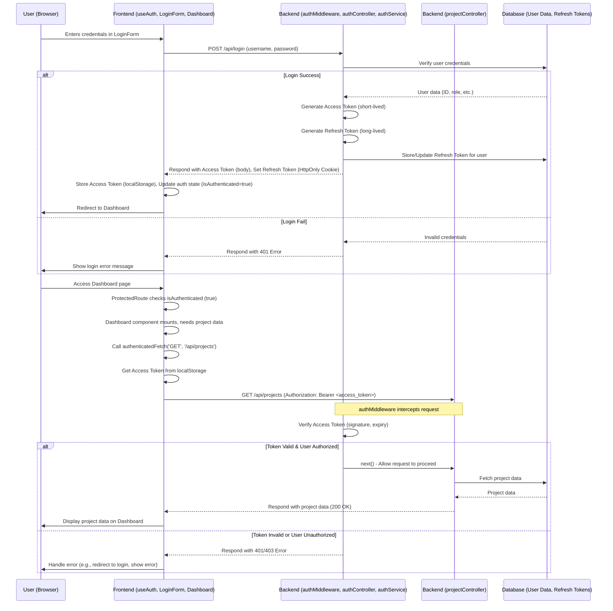

# Chapter 2: Authentication & Authorization

Welcome back! In the previous chapter, we established our project's data blueprint using the [Chapter 1: Shared Data Schema](01_shared_data_schema_.md). We defined *what* our data looks like (like Clients, Projects, Expenses). Now, we need to figure out *who* gets to see and modify this data.

## What Problem Does This Solve? The Building Security Analogy

Imagine our finance tracker application is a secure office building.

*   You can't just walk in off the street and access sensitive financial documents.
*   First, you need to prove *who you are* at the front desk (**Authentication**). Maybe you show an ID card or type a password.
*   Once inside, your access might be limited. A regular employee might only access their own desk and the break room, while the CEO can enter any office (**Authorization**).

Without security:
*   Anyone could see confidential project budgets or client information.
*   Unauthorized people could add fake expenses or delete important records.
*   Chaos ensues!

**Authentication** is about verifying **identity**: Are you really who you say you are? (Logging In)
**Authorization** is about verifying **permissions**: *Now that we know who you are*, what are you allowed to do? (Access Control)

In our `Project-Finance-Tracker`, we need a system to:
1.  Let users securely log in.
2.  Protect pages and data so only logged-in users can access them.
3.  Potentially restrict certain actions based on a user's role (e.g., only 'Managers' can approve expenses).

**Our Goal (Use Case):** Let's say a user opens the app. We want to ensure they **must log in** before they can see the main dashboard (which displays project summaries). If they try to access the dashboard directly without logging in, they should be redirected to the login page.

## Key Concepts

Let's break down the security components in our project:

1.  **Authentication (Logging In):**
    *   **Frontend:** The user enters their username and password into a `LoginForm`.
    *   **Backend:** The `authService.ts` receives these credentials, checks them against the stored user data (likely comparing a hashed password, covered implicitly by `storage.verifyUser`), and confirms if the user is valid.

2.  **JWT Tokens (The Digital ID Card):**
    *   Instead of making the user log in for *every single action*, the backend issues a special digital token called a **JSON Web Token (JWT)** after a successful login. Think of this like a temporary access badge.
    *   This token contains information about the user (like their ID and role) and is digitally signed by the server to prevent tampering.
    *   **Access Token:** A short-lived token (e.g., 15 minutes) used for most requests. It's sent with each request to prove identity.
    *   **Refresh Token:** A longer-lived token (e.g., 7 days) stored securely (as an `HttpOnly` cookie). It's used *only* to get a new access token when the old one expires, without forcing the user to log in again.

3.  **Frontend Security (`useAuth.tsx` - The Bouncer at the Club Door):**
    *   This is a React hook that acts as our frontend's security guard.
    *   It keeps track of whether the user is currently logged in (`isAuthenticated`).
    *   It provides functions like `login()` and `logout()`.
    *   Crucially, it provides `authenticatedFetch()`. When the frontend needs data from a protected backend API (like project lists), it uses `authenticatedFetch`. This function automatically attaches the current Access Token (the ID card) to the request. If the token is expired, it tries to use the Refresh Token to get a new one behind the scenes.

4.  **Backend Middleware (`authMiddleware.ts` - The Checkpoint Guard):**
    *   This is a piece of code on the server that runs *before* the actual API logic for protected routes.
    *   It checks incoming requests for the `Authorization: Bearer <token>` header.
    *   It verifies the Access Token: Is it valid? Is it expired? Was it actually issued by *this* server?
    *   It performs **Authorization**: If the route requires a specific role (e.g., 'Admin'), it checks if the user identified by the token has that role.
    *   If everything checks out, it allows the request to proceed to the intended API handler. If not, it sends back an error (like 401 Unauthorized or 403 Forbidden).

5.  **Backend Service (`authService.ts` - The ID Card Issuer & Verifier):**
    *   Handles the core logic for authentication.
    *   `register()`: Creates a new user account.
    *   `login()`: Verifies username/password and generates the initial Access and Refresh tokens.
    *   `refresh()`: Takes a valid Refresh Token and issues a new Access Token (and potentially a new Refresh Token).
    *   `logout()`: Invalidates the user's Refresh Token on the server side.

## Solving the Use Case: Protecting the Dashboard

Remember our goal: A user must log in to see the dashboard.

**1. Frontend Login (`LoginForm.tsx`)**

The user interacts with the login form. When they submit:

```typescript
// Simplified snippet from client/src/components/forms/login-form.tsx

import { useForm } from "react-hook-form";
// ... other imports
// 👇 Import the login function from our security guard hook
import { useAuth } from "@/hooks/useAuth";

// ... form setup (using schema from Chapter 1) ...

export function LoginForm() {
  // 👇 Get the login function and other helpers
  const { login, isLoading } = useAuth();
  const [, navigate] = useLocation();
  const form = useForm(/* ... */);

  async function onSubmit(values: /* ... */) {
    setIsLoading(true);
    try {
      // 👇 Call the login function provided by useAuth
      await login(values.username, values.password);
      // If login is successful, navigate to the dashboard
      navigate("/");
    } catch (error) {
      // Show an error message if login fails
      toast(/* ... */);
    } finally {
      setIsLoading(false);
    }
  }

  // ... rest of the form component (UI inputs, button) ...
}
```

*   **Input:** User enters username and password.
*   **Process:** The form calls the `login` function from `useAuth`. This function sends the credentials to the backend `/api/login` endpoint. If successful, `useAuth` stores the received tokens and updates its state to indicate the user is authenticated.
*   **Output:** The user is redirected to the main page (`/`).

**2. Backend Login (`authController.ts` & `authService.ts`)**

The `/api/login` request reaches the server:

```typescript
// Simplified snippet from server/controllers/authController.ts
import { authService } from "../services/authService";
// ... other imports

export const authController = {
  async login(req: Request, res: Response) {
    try {
      // 👇 Pass credentials to the auth service for verification & token generation
      const { accessToken, refreshToken } = await authService.login(req.body);

      // Set the refresh token securely in an HttpOnly cookie
      res.cookie("refreshToken", refreshToken, { /* ... secure cookie options ... */ });
      // Send the short-lived access token back in the response body
      res.json({ accessToken });
    } catch (err: any) {
      res.status(401).json({ message: err.message }); // Send error if login fails
    }
  },
  // ... other methods like register, refresh, logout
};
```

*   **Input:** Request containing username and password.
*   **Process:** The controller calls `authService.login()`. `authService` verifies the credentials against the database (using `storage.verifyUser`). If valid, it generates *both* an Access Token and a Refresh Token using functions from `utils/jwt.ts`. The Refresh Token is stored associated with the user in the database (via `storage.updateRefreshToken`).
*   **Output:** Sends the Access Token back to the frontend and sets the Refresh Token as a secure `HttpOnly` cookie (meaning JavaScript in the browser can't directly access it, enhancing security).

**3. Frontend Protected Route (`App.tsx`)**

Now, how do we protect the dashboard page itself?

```typescript
// Simplified snippet from client/src/App.tsx
import { useAuth } from "@/hooks/useAuth";
import Dashboard from "@/pages/dashboard";
// ... other imports

// A wrapper component for routes that require login
function ProtectedRoute({ component: Component, ...rest }: any) {
  // 👇 Check authentication status from our security guard hook
  const { isAuthenticated, isLoading } = useAuth();
  const [, navigate] = useLocation();

  if (isLoading) return <div>Loading...</div>; // Show loading while checking auth

  if (!isAuthenticated) {
    // If not logged in, redirect to the login page
    navigate("/login");
    return null; // Don't render the protected component
  }

  // If logged in, render the requested component (e.g., Dashboard)
  return <Component {...rest} />;
}

function Router() {
  const { isAuthenticated } = useAuth(); // Check status for conditional rendering

  return (
    <Switch>
      <Route path="/login" component={Login} />
      <Route path="/register" component={Register} />

      {/* Only render AppShell and protected routes if authenticated */}
      {isAuthenticated && (
        <AppShell>
          <Switch>
            {/* 👇 Use ProtectedRoute for the dashboard */}
            <Route path="/" component={() => <ProtectedRoute component={Dashboard} />} />
            {/* Other protected routes */}
            <Route path="/projects" component={() => <ProtectedRoute component={Projects} />} />
            {/* ... */}
          </Switch>
        </AppShell>
      )}

      {/* Fallback */}
      <Route component={NotFound} />
    </Switch>
  );
}

// ... App component wrapping everything in AuthProvider ...
```

*   **Process:** When the user navigates to `/`, the `ProtectedRoute` component checks `isAuthenticated` from `useAuth`.
*   **Output (If Not Authenticated):** The user is redirected to `/login`.
*   **Output (If Authenticated):** The `Dashboard` component is rendered.

**4. Frontend Fetching Protected Data (`Dashboard.tsx` -> `useAuth.authenticatedFetch`)**

The Dashboard likely needs to fetch data, like project summaries.

```typescript
// Conceptual example of fetching data in a component like Dashboard
import { useAuth } from "@/hooks/useAuth";
import { useQuery } from "@tanstack/react-query"; // Covered in Chapter 6

function Dashboard() {
  // 👇 Get the special fetch function
  const { authenticatedFetch } = useAuth();

  // Fetch project data using React Query (more in Chapter 6)
  const { data: projects, isLoading } = useQuery({
    queryKey: ["projects"], // Unique key for this query
    queryFn: async () => {
      // 👇 Use authenticatedFetch to make the request
      const response = await authenticatedFetch("GET", "/api/projects");
      if (!response.ok) throw new Error("Failed to fetch projects");
      return response.json();
    },
  });

  // ... render projects or loading state ...
}
```

*   **Process:** Instead of using the standard `fetch`, the component uses `authenticatedFetch` from `useAuth`. This function automatically grabs the stored Access Token and adds it to the request headers (`Authorization: Bearer <token>`).

**5. Backend Authorizing Data Access (`routes.ts` & `authMiddleware.ts`)**

The request for `/api/projects` reaches the server. Before the `projectController` handles it, the middleware steps in.

```typescript
// Simplified snippet from server/routes.ts
import { authMiddleware } from '../middleware/authMiddleware';
import { projectController } from '../controllers/projectController';
// ... other imports

const router = express.Router();

// ... other routes ...

// 👇 Apply the authMiddleware to the projects route
// This means a valid token is required to access this endpoint.
router.get('/projects', authMiddleware(), projectController.getProjects);

// Example of role-based authorization:
// Only Admins and Managers can update project status
router.patch('/projects/:id/status',
  authMiddleware([UserRole.ADMIN, UserRole.MANAGER]), // Checks token AND role
  projectController.updateProjectStatus
);

// ... other routes ...

export default router;
```

```typescript
// Simplified snippet from server/middleware/authMiddleware.ts
import jwt from "jsonwebtoken";
// ... other imports

const JWT_SECRET = process.env.MY_JWT_SECRET!;

// Middleware function factory
export const authMiddleware = (allowedRoles: UserRoleType[] = []) => {
  return async (req: AuthenticatedRequest, res: Response, next: NextFunction) => {
    const authHeader = req.headers.authorization; // Get "Bearer <token>"

    if (!authHeader || !authHeader.startsWith("Bearer ")) {
      return res.status(401).json({ message: "Missing token" });
    }

    const token = authHeader.split(" ")[1]; // Extract the token part
    try {
      // 👇 Verify the token using the secret key
      const decoded = jwt.verify(token, JWT_SECRET) as DecodedToken;

      // Attach user info (from token) to the request object
      req.user = { id: decoded.id, role: decoded.role };

      // Check if the user's role is allowed for this route
      if (allowedRoles.length > 0 && !allowedRoles.includes(decoded.role)) {
        return res.status(403).json({ message: "Forbidden: insufficient permissions" });
      }

      // 👇 If token is valid and roles match, proceed to the next handler (e.g., projectController.getProjects)
      next();
    } catch (err) {
      // If token is invalid or expired
      return res.status(403).json({ message: "Invalid or expired access token" });
    }
  };
};
```

*   **Input:** Incoming request to `/api/projects` with an `Authorization: Bearer <token>` header.
*   **Process:**
    *   `authMiddleware` extracts the token.
    *   `jwt.verify()` checks the token's signature and expiration using the `JWT_SECRET`.
    *   If the route specified `allowedRoles` (like `[UserRole.ADMIN]`), it checks the `role` inside the decoded token.
    *   If valid and authorized, `next()` passes the request to `projectController.getProjects`.
*   **Output:** Either the request proceeds, or a 401/403 error is sent back.

This completes the loop, ensuring only authenticated (and potentially authorized) users can access protected resources like the dashboard and its data.

## How It Works Internally: The Flow of Security Checks

Let's visualize the process using our Nightclub Bouncer analogy.

**Step-by-Step (Accessing the VIP Lounge - `/api/projects`):**

1.  **User Tries to Enter (Frontend Request):** The `Dashboard` component needs project data and calls `authenticatedFetch("GET", "/api/projects")`.
2.  **Show Your ID (Attaching Token):** `authenticatedFetch` retrieves the Access Token from storage (`localStorage`).
3.  **Check ID Expiry (Token Check):** `useAuth` checks if the Access Token is expired (`isTokenExpired`).
    *   *If Expired:* `useAuth` silently calls `refreshAccessToken()` which sends the *Refresh Token* (from the secure cookie) to `/api/refresh`. The backend's `authService.refresh` verifies it, issues a *new* Access Token, and sends it back. `useAuth` stores the new token.
    *   *If Not Expired (or just refreshed):* Proceed.
4.  **Send Request with ID (Making the API Call):** `authenticatedFetch` makes the `GET /api/projects` request, adding the header: `Authorization: Bearer <access_token>`.
5.  **Bouncer at the Door (Backend Middleware):** The request hits the server. `authMiddleware` intercepts it *before* the `projectController`.
6.  **Verify ID (Token Verification):** `authMiddleware` extracts the token from the header and uses `jwt.verify()` with the `JWT_SECRET` to check if it's valid and not expired.
7.  **Check VIP List (Authorization):** If the route required specific roles (e.g., `authMiddleware([UserRole.ADMIN])`), the middleware checks the `role` claim inside the verified token against the allowed roles.
8.  **Entry Granted/Denied (Middleware Outcome):**
    *   *If Valid & Authorized:* `next()` is called, allowing the request to proceed to `projectController.getProjects`.
    *   *If Invalid/Expired/Unauthorized:* The middleware sends a 401 or 403 error response back to the frontend immediately.
9.  **Access Granted (Controller Logic):** If allowed, `projectController.getProjects` runs, fetches data, and sends it back to the frontend.

**Sequence Diagram (Login & Access Protected Route):**



This diagram shows the initial login flow setting up the tokens, followed by accessing a protected route where the `authMiddleware` acts as the gatekeeper verifying the Access Token before allowing access to the actual API logic (`projectController`).

## Conclusion

In this chapter, we tackled the essential concepts of **Authentication** (proving who you are) and **Authorization** (what you're allowed to do).

*   We saw how users log in via the frontend (`LoginForm`, `useAuth`) and how the backend (`authService`) verifies credentials.
*   We learned about **JWT Access Tokens** (short-term ID cards) and **Refresh Tokens** (long-term keys for getting new ID cards) used to maintain sessions securely.
*   The `useAuth` hook on the frontend acts as a security guard, managing login state and making secure API calls using `authenticatedFetch`.
*   The `authMiddleware` on the backend acts as a checkpoint, verifying tokens and checking permissions for protected API routes before allowing access.

With a secure way to manage users and control access, we can now look deeper into how the backend is structured to handle these API requests and interact with the database.

**Next:** [Chapter 3: Server API Structure (Express, Controllers, Services)](03_server_api_structure__express__controllers__services__.md)

---

Generated by [AI Codebase Knowledge Builder](https://github.com/The-Pocket/Tutorial-Codebase-Knowledge)