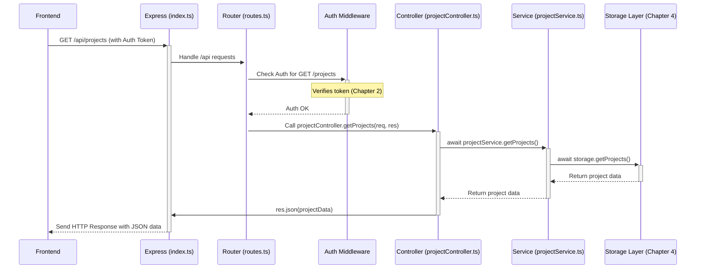

# Chapter 3: Server API Structure (Express, Controllers, Services)

Welcome back! In the previous chapter, [Chapter 2: Authentication & Authorization](02_authentication___authorization_.md), we learned how to secure our application by verifying user identity and controlling access. Now that we know *who* is making requests, let's explore *how* our server (the backend) handles those requests in an organized way.

## What Problem Does This Solve? The Restaurant Kitchen Analogy

Imagine a busy restaurant. When a customer places an order (makes a request), it doesn't just randomly float into the kitchen. There's a system:

1.  **Waiter (Express - `server/index.ts`)**: Takes the order (receives the incoming HTTP request).
2.  **Order Ticket System (Router - `server/routes/routes.ts`)**: The waiter puts the order on a specific hook or passes it to the correct station based on what was ordered (e.g., appetizer station, main course station). This system directs the order.
3.  **Station Chef (Controller - e.g., `projectController.ts`)**: The chef at the main course station receives the order ticket. They understand *what* needs to be made (e.g., "Get Projects") but might not cook every single component themselves. They might check if the order is valid (e.g., "Do we have the ingredients?").
4.  **Line Cooks (Service - e.g., `projectService.ts`)**: The station chef tells the line cooks the specific tasks needed (e.g., "Prepare the project data from the pantry/database"). These cooks perform the detailed work.

Without this structure:
*   Orders might get lost or ignored.
*   The wrong chef might try to cook the wrong dish.
*   The head chef might get overwhelmed trying to do everything.
*   Chaos ensues!

Our server needs a similar structure to handle requests from the frontend (like "save this new client," "fetch all projects," "log the user in"). If every request was handled in one giant file, it would quickly become unmanageable and hard to debug.

The **Express/Controllers/Services** pattern provides this organization.

**Our Goal (Use Case):** Let's say the user navigates to the "Projects" page in the frontend. The frontend needs to display a list of all projects. To do this, it will send a request to the backend API asking for this list. We need our server to:
1. Receive this request.
2. Understand it's asking for projects.
3. Fetch the project data (from the database, which we'll cover later).
4. Send the list of projects back to the frontend.

## Key Concepts: The Backend Team

Let's meet the key players in our backend structure:

1.  **Express (`server/index.ts` - The Reception Desk / Waiter):**
    *   This is the main entry point for *all* requests coming into our server. We use the **Express.js** framework to create our web server.
    *   It listens for network requests (like someone visiting `/api/projects` in their browser or the frontend code making a request).
    *   It performs initial setup, like enabling JSON parsing and handling cookies ([Chapter 2: Authentication & Authorization](02_authentication___authorization_.md)).
    *   Its main job related to handling requests is to pass them off to the Router.

    ```typescript
    // Simplified snippet from server/index.ts
    import express from "express";
    import routes from "./routes/routes"; // Importing the router
    import cookieParser from "cookie-parser";

    const app = express();
    app.use(express.json()); // Allow server to understand JSON data
    app.use(cookieParser()); // Allow server to read cookies (for auth)

    // 👇 Tell Express to use our router for any requests starting with /api
    app.use('/api', routes);

    // ... rest of the server setup (listening on a port, etc.) ...
    ```
    *   This code sets up the Express application and tells it that any request whose path starts with `/api` should be handled by the `routes` object we imported.

2.  **Router (`server/routes/routes.ts` - The Directory / Order Ticket System):**
    *   This file acts like a map or directory for our API.
    *   It defines specific *routes* (URL paths and HTTP methods like GET, POST, PATCH).
    *   For each route, it specifies which **Controller** function should handle the request.
    *   It can also specify **Middleware** (like our `authMiddleware` from [Chapter 2: Authentication & Authorization](02_authentication___authorization_.md)) that should run *before* the controller function (e.g., to check if the user is logged in).

    ```typescript
    // Simplified snippet from server/routes/routes.ts
    import express from 'express';
    import { projectController } from '../controllers/projectController';
    import { authMiddleware } from '../middleware/authMiddleware';

    const router = express.Router();

    // 👇 Define the route for getting projects:
    // Method: GET
    // Path: /projects (relative to '/api', so full path is /api/projects)
    // Middleware: authMiddleware() - User must be logged in
    // Handler: projectController.getProjects - The function to call
    router.get('/projects', authMiddleware(), projectController.getProjects);

    // Example: Route for creating a project (POST request)
    router.post('/projects/create', authMiddleware(/* roles? */), projectController.createProject);

    // ... other routes for clients, expenses, auth, etc. ...

    export default router; // Export the configured router
    ```
    *   This code defines that a `GET` request to `/api/projects` must first pass the `authMiddleware` check, and if successful, should be handled by the `getProjects` function inside the `projectController`.

3.  **Controller (`server/controllers/projectController.ts` - The Department Manager / Station Chef):**
    *   A controller bundles related request-handling functions for a specific resource (like "Projects", "Clients", "Users").
    *   Each function in a controller handles a specific action (e.g., `getProjects`, `createProject`, `getProjectById`).
    *   It receives the request object (`req`) and the response object (`res`) from Express.
    *   It understands the *intent* of the request (e.g., "fetch all projects").
    *   It might do some basic parsing of input (like getting an ID from the URL).
    *   Crucially, it **delegates** the actual work (database interaction, complex logic) to a **Service**.
    *   It then takes the result from the Service and sends the response back to the client using `res.json()`, `res.status()`, etc.

    ```typescript
    // Simplified snippet from server/controllers/projectController.ts
    import { Request, Response } from "express";
    import { projectService } from "../services/projectService"; // Import the service

    export const projectController = {
      // Function to handle GET /api/projects
      async getProjects(req: Request, res: Response) {
        try {
          // 👇 Delegate the work of fetching projects to the service
          const projects = await projectService.getProjects();

          // Send the result back to the frontend as JSON
          res.json(projects);
        } catch (err: any) {
          // If anything goes wrong, send an error status and message
          console.error(err);
          res.status(500).json({ message: "Failed to get projects" });
        }
      },

      // Function to handle POST /api/projects/create (example)
      async createProject(req: Request, res: Response) {
        try {
          const projectData = req.body; // Get data from request body
          // We could add validation here using Zod from Chapter 1
          // 👇 Delegate the work of creating the project to the service
          const newProject = await projectService.createProject(projectData);
          res.status(201).json(newProject); // Send 201 Created status
        } catch (err: any) {
          console.error(err);
          res.status(400).json({ message: err.message }); // Send Bad Request error
        }
      },
      // ... other functions like getProject(byId), updateProjectStatus ...
    };
    ```
    *   The `getProjects` function here doesn't know *how* to get projects from the database. It just knows it needs to call `projectService.getProjects()` and then send whatever that returns back to the client.

4.  **Service (`server/services/projectService.ts` - The Expert Worker / Line Cook):**
    *   A service contains the core **business logic** and data interaction logic for a resource.
    *   It's responsible for the "how" – *how* to fetch projects, *how* to calculate something, *how* to interact with the database (usually via another abstraction layer, see [Chapter 4: Database Interaction (Drizzle & Storage Abstraction)](04_database_interaction__drizzle___storage_abstraction_.md)).
    *   It gets called by the Controller.
    *   It performs the necessary operations (fetching data, calculations, calling other services if needed).
    *   It returns the result back to the Controller. It generally doesn't know about the web request/response cycle (req/res objects).

    ```typescript
    // Simplified snippet from server/services/projectService.ts
    import { storage } from "../storage"; // Import the database interaction layer
    import { Project, InsertProject } from "@shared/schema";

    export const projectService = {
      // How to get all projects
      async getProjects(): Promise<Project[]> {
        // 👇 Ask the storage layer (database interface) to get the projects
        // We'll learn about 'storage' in the next chapter!
        const projects = await storage.getProjects();
        // Maybe perform some extra logic/calculation here if needed...
        return projects;
      },

      // How to create a project
      async createProject(projectData: InsertProject): Promise<Project> {
        // Maybe perform validation or add default values...
        // 👇 Ask the storage layer to save the new project
        const newProject = await storage.createProject(projectData);
        // Maybe send a notification or log an activity...
        return newProject;
      },

      // ... other functions like getProject(byId), updateProjectStatus ...
    };
    ```
    *   The `getProjects` function in the service focuses purely on the task of retrieving project data, using the `storage` object to handle the database details.

## Solving the Use Case: Fetching the Project List

Let's trace how our use case (fetching the project list for the frontend) flows through this structure:

1.  **Frontend Request:** The user goes to the Projects page. The frontend code (using `authenticatedFetch` from [Chapter 2: Authentication & Authorization](02_authentication___authorization_.md)) sends a `GET` request to the URL `/api/projects`. This request includes the user's authentication token in the headers.
2.  **Express (`server/index.ts`):** The Express server receives the incoming `GET /api/projects` request. It sees the `/api` prefix and passes the request to our main router (`routes`).
3.  **Router (`server/routes/routes.ts`):** The router looks at its list of routes. It finds a match:
    *   `GET /projects` -> `authMiddleware()` then `projectController.getProjects`
    *   It first runs `authMiddleware()`. This checks the authentication token (from Chapter 2). Let's assume the token is valid.
    *   Since authentication passed, the router now calls the `projectController.getProjects` function, passing along the request (`req`) and response (`res`) objects.
4.  **Controller (`projectController.ts`):** The `getProjects` function inside `projectController` is executed.
    *   **Input:** `req` (contains request details), `res` (used to send the response).
    *   **Process:** It executes `await projectService.getProjects()`. It waits for the service to do its job and return the list of projects.
    *   **Output:** It receives the `projects` array from the service. It then calls `res.json(projects)` to send this array back to the frontend as JSON data.
5.  **Service (`projectService.ts`):** The `getProjects` function inside `projectService` is executed.
    *   **Input:** (None needed for this specific function).
    *   **Process:** It executes `await storage.getProjects()`. It calls the storage layer (which handles the actual database query – see [Chapter 4: Database Interaction (Drizzle & Storage Abstraction)](04_database_interaction__drizzle___storage_abstraction_.md)) to fetch all project records.
    *   **Output:** It receives the project data from the storage layer and returns this data to the controller.
6.  **Frontend Receives:** The frontend code that made the initial request receives the JSON response containing the array of projects. It can then use this data to display the list to the user (covered in [Chapter 6: Data Fetching & State (React Query)](06_data_fetching___state__react_query_.md)).

This clear separation makes the code much easier to understand, test, and maintain. If there's a bug in fetching projects, we know whether to look in the Controller (is it calling the right service? sending the response correctly?) or the Service (is the logic to get data correct? is it calling storage correctly?).

## How It Works Internally: The Request Journey

Let's visualize the flow again using our Restaurant analogy.

**Step-by-Step (Ordering "All Projects"):**

1.  **Frontend (Customer):** Places an order: "I want all the projects!" (`GET /api/projects`).
2.  **Express (Waiter):** Receives the order at the main entrance (`server/index.ts`). Sees it's an API order (`/api`) and takes it to the order ticket station.
3.  **Router (Order Ticket System):** Looks at the ticket (`GET /projects`). Sees it needs authentication (checks the customer's ID card/token - `authMiddleware`). ID is valid. Sees the order should go to the "Project Station Chef" (`projectController.getProjects`).
4.  **Controller (Project Station Chef):** Receives the ticket (`projectController.getProjects` runs). Reads the order: "Get Projects". Tells the "Project Line Cook": "Prepare all projects!" (`await projectService.getProjects()`).
5.  **Service (Project Line Cook):** Gets the instruction (`projectService.getProjects` runs). Goes to the pantry/database (`await storage.getProjects()`) to gather all the project ingredients/data. Returns the prepared data to the Station Chef.
6.  **Controller (Project Station Chef):** Receives the prepared project data from the Line Cook. Puts it on a plate and hands it back to the Waiter (`res.json(projects)`).
7.  **Express (Waiter):** Delivers the plate of project data back to the Customer (sends the HTTP response).
8.  **Frontend (Customer):** Receives the plate (the data) and displays it.

**Sequence Diagram:**



This diagram shows the request flowing from the Frontend, through Express, the Router, Authentication, the Controller, the Service, and finally interacting with the Storage layer (covered next chapter) before the response flows back.

## Conclusion

In this chapter, we explored the structure of our backend API using the **Express, Controllers, and Services** pattern.

*   **Express (`server/index.ts`)** is our main server entry point.
*   The **Router (`server/routes/routes.ts`)** acts as a directory, mapping URL paths to specific Controller functions and applying middleware like authentication.
*   **Controllers (e.g., `projectController.ts`)** handle the incoming request and response, understand the request's intent, and delegate work to Services.
*   **Services (e.g., `projectService.ts`)** contain the core business logic and interact with lower layers (like the database) to perform the actual work.

This separation of concerns makes our backend code organized, easier to test, and more maintainable as the application grows.

Now that we understand how requests flow through the server and how logic is delegated to services, the next logical step is to see how those services actually interact with the database to fetch and store data.

**Next:** [Chapter 4: Database Interaction (Drizzle & Storage Abstraction)](04_database_interaction__drizzle___storage_abstraction_.md)

---

Generated by [AI Codebase Knowledge Builder](https://github.com/The-Pocket/Tutorial-Codebase-Knowledge)