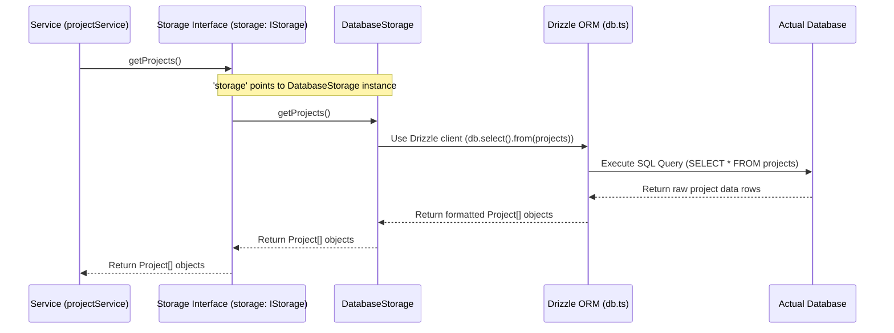

# Chapter 4: Database Interaction (Drizzle & Storage Abstraction)

Welcome back! In [Chapter 3: Server API Structure (Express, Controllers, Services)](03_server_api_structure__express__controllers__services__.md), we saw how our backend server organizes its work using Controllers and Services. We learned that a `Service` like `projectService` handles the core logic, like fetching a list of projects. But we left a little mystery: how does the service *actually* get the data? Where does it come from?

That's what we'll uncover in this chapter: how our application talks to the database.

## What Problem Does This Solve? The Universal Remote Analogy

Imagine you have several devices: a TV, a Blu-ray player, and a sound system. Each device has its own remote control with different buttons and ways of working. It's annoying to juggle multiple remotes!

What's the solution? A **universal remote**! You program it once for each device, and then you use the *same* buttons on the universal remote (like "Volume Up", "Channel Down", "Play") regardless of which device you're controlling. The universal remote handles translating your button press into the specific command each device understands.

In our application, the `projectService` (and other services) needs to perform actions like "get all projects," "create a new client," "find a user by ID." These actions involve interacting with a data store.

*   During development or testing, we might want to use a simple, temporary in-memory store (like a quick list stored in the computer's RAM).
*   In production (when real users use the app), we need to use a persistent, real database (like PostgreSQL).

If we wrote the `projectService` to *directly* talk to PostgreSQL, it would be difficult and time-consuming to switch to the in-memory store for testing. We'd have to rewrite parts of the service!

The **Storage Abstraction** is our "universal remote" for data. It defines a standard set of "buttons" (functions like `getProjects()`, `createClient()`) that our services can use. We then have different "device programs" (implementations like `MemStorage` for in-memory or `DatabaseStorage` for the real database) that know how to translate those standard buttons into specific actions for their respective data stores.

**Drizzle ORM** is like the detailed instruction manual the universal remote uses to talk to a specific, complex device (our PostgreSQL database). It helps translate the standard button presses into the precise language (SQL) the database understands.

**Our Goal (Use Case):** Remember in Chapter 3, the `projectService` needed to get a list of all projects? Let's trace how it uses the Storage Abstraction and Drizzle to achieve this.

```typescript
// Simplified from server/services/projectService.ts
import { storage } from "../storage"; // <-- Importing our "universal remote"

export const projectService = {
  async getProjects(): Promise<Project[]> {
    // 👇 Pressing the "Get Projects" button on the universal remote
    const projects = await storage.getProjects();
    return projects;
  },
  // ... other functions
};
```

We need to understand what `storage` is and how it performs the `getProjects()` action.

## Key Concepts: The Data Communication Team

Let's meet the players involved in getting data:

1.  **Drizzle ORM (`db.ts`, `drizzle.config.ts` - The Translator & Configuration):**
    *   **ORM** stands for Object-Relational Mapper. It's a tool that lets us work with our database using familiar JavaScript/TypeScript objects and methods instead of writing raw SQL commands directly.
    *   `drizzle.config.ts`: Tells Drizzle where to find our data blueprints ([Chapter 1: Shared Data Schema](01_shared_data_schema_.md)) and how to connect to the database. It's used mainly for setting up and updating the database structure (migrations).
    *   `db.ts`: Sets up the *live* connection to the database during runtime and exports the Drizzle instance (`db`) that we use to actually query data. It uses the schema definitions to know *how* to translate our code into SQL.

    ```typescript
    // Simplified from server/db.ts
    import { Pool } from '@neondatabase/serverless';
    import { drizzle } from 'drizzle-orm/neon-serverless';
    import * as schema from "@shared/schema"; // Import the data blueprints

    // Connect to the database (connection details usually in environment variables)
    export const pool = new Pool({ /* ... connection settings ... */ });

    // Create the Drizzle instance - our translator!
    export const db = drizzle({ client: pool, schema });
    ```
    *   This code creates the `db` object, which is our primary tool for interacting with the database via Drizzle. It links the database connection (`pool`) with our data definitions (`schema`).

2.  **Storage Interface (`IStorage` in `storage.ts` - The Universal Remote Button Layout):**
    *   This is a TypeScript `interface`. It defines the *contract* or the standard set of "buttons" that any data storage mechanism *must* provide. It doesn't contain any actual logic, just the function names and their expected inputs/outputs.
    *   Services like `projectService` are written to use this interface, ensuring they don't depend on *how* the data is stored, only on the *availability* of these standard functions.

    ```typescript
    // Simplified from server/storage.ts
    import { Project, InsertProject, /* ...other types */ } from "@shared/schema";

    // The contract: any storage system must have these functions
    export interface IStorage {
      getProjects(): Promise<Project[]>; // Button to get all projects
      createProject(project: InsertProject): Promise<Project>; // Button to add a project
      getUser(id: number): Promise<User | undefined>; // Button to get a user
      // ... many other functions for clients, expenses, etc.
    }
    ```
    *   This interface guarantees that any class implementing `IStorage` will have a `getProjects` method that returns a Promise resolving to an array of `Project` objects.

3.  **Storage Implementations (`DatabaseStorage`, `MemStorage` in `storage.ts` - The Device-Specific Programs):**
    *   These are actual classes that *implement* the `IStorage` interface. They provide the real code for each "button" defined in the interface.
    *   `DatabaseStorage`: Implements the `IStorage` functions by using **Drizzle** (`db`) to talk to the actual PostgreSQL database. This is used in production.
    *   `MemStorage`: Implements the `IStorage` functions by manipulating simple arrays or maps in the computer's memory. This is useful for testing or quick development without needing a real database.

    ```typescript
    // Simplified from server/storage.ts - Database Implementation
    import { db } from './db'; // Import the Drizzle instance
    import { projects } from '@shared/schema'; // Import the table definition

    class DatabaseStorage implements IStorage {
      async getProjects(): Promise<Project[]> {
        // Use Drizzle to select all columns from the projects table
        const allProjects = await db.select().from(projects);
        return allProjects;
      }
      // ... implementations for other IStorage methods using 'db' ...
    }
    ```

    ```typescript
    // Simplified from server/storage.ts - In-Memory Implementation
    class MemStorage implements IStorage {
      private projects: Map<number, Project>; // Store projects in memory

      constructor() {
        this.projects = new Map();
        // Maybe add some initial dummy data
      }

      async getProjects(): Promise<Project[]> {
        // Just return the values from the in-memory map
        return Array.from(this.projects.values());
      }
      // ... implementations for other IStorage methods manipulating maps/arrays ...
    }
    ```
    *   Notice how both classes have the `getProjects` method as required by `IStorage`, but they implement it differently. `DatabaseStorage` uses `db.select().from(projects)`, while `MemStorage` uses `Array.from(this.projects.values())`.

4.  **The Exported `storage` Object (`storage.ts` - Choosing Which Remote Program to Use):**
    *   At the end of `storage.ts`, we decide which implementation to actually use for the rest of the application. We export an instance of either `DatabaseStorage` or `MemStorage` as the `storage` object.

    ```typescript
    // Simplified from server/storage.ts

    // For real database connections, use:
    export const storage: IStorage = new DatabaseStorage(); // <= This is the active line

    // For in-memory storage, use:
    // export const storage: IStorage = new MemStorage();
    ```
    *   This line determines that whenever any service imports `storage`, it will get an instance of `DatabaseStorage`. To switch to the in-memory version for testing, we would just comment out the `DatabaseStorage` line and uncomment the `MemStorage` line – *no changes needed in any of the services!*

## Solving the Use Case: Fetching the Project List

Now let's put it all together for our use case: `projectService` fetching the list of projects.

1.  **`projectService` Needs Data:** The `projectService.getProjects` function is called (as seen in [Chapter 3: Server API Structure (Express, Controllers, Services)](03_server_api_structure__express__controllers__services__.md)).
2.  **Using the Universal Remote:** Inside `projectService`, it calls `storage.getProjects()`. It doesn't know or care *how* `storage` works, only that it has a `getProjects` button (thanks to the `IStorage` interface).
3.  **The Active Program Runs:** Because `storage` is currently an instance of `DatabaseStorage` (based on the export in `storage.ts`), the `getProjects` method inside the `DatabaseStorage` class is executed.
4.  **Talking to the Database:** The `DatabaseStorage.getProjects` method uses the Drizzle instance (`db`) imported from `db.ts`. It runs `await db.select().from(projects);`.
5.  **Drizzle Does the Translation:** Drizzle takes the `db.select().from(projects)` command and, using the schema information, translates it into the correct SQL query: `SELECT id, name, "clientId", status, "startDate", budget, "createdById" FROM projects;`.
6.  **Database Responds:** Drizzle sends this SQL query to the PostgreSQL database via the connection pool (`pool` from `db.ts`). The database executes the query and sends back the raw data rows.
7.  **Drizzle Formats the Result:** Drizzle receives the raw rows and transforms them into an array of JavaScript `Project` objects, matching the structure defined in our [Chapter 1: Shared Data Schema](01_shared_data_schema_.md).
8.  **Data Returns:** The array of `Project` objects is returned from `DatabaseStorage.getProjects` back to `projectService`.
9.  **Service Completes:** `projectService` receives the array and returns it to the `projectController`, which then sends it back to the frontend.

The beauty is that the `projectService` only interacted with the `storage` object at the `IStorage` interface level. All the details of Drizzle and SQL were hidden within the `DatabaseStorage` implementation.

## How It Works Internally: The Flow of Data Retrieval

Let's visualize this using our Universal Remote analogy.

**Step-by-Step (Pressing "Get Projects"):**

1.  **`projectService` (You):** Wants to see all projects, so you press the "Get Projects" button on the universal remote (`storage.getProjects()`).
2.  **`storage` (Universal Remote):** Knows it's currently set to control the "PostgreSQL Database" device (`DatabaseStorage` instance). It passes the "Get Projects" command to that device's logic.
3.  **`DatabaseStorage` (Device Logic):** Receives the "Get Projects" command. It consults its internal translator, Drizzle (`db`).
4.  **Drizzle (`db` - Translator):** Is told "get everything from projects". It translates this into the database's specific language: `SELECT * FROM projects;`.
5.  **Database (The Actual Device):** Receives the `SELECT * FROM projects;` command, finds all the project data, and sends it back.
6.  **Drizzle (`db` - Translator):** Receives the raw data rows from the database and formats them nicely into JavaScript `Project` objects.
7.  **`DatabaseStorage` (Device Logic):** Gets the formatted `Project` objects from Drizzle.
8.  **`storage` (Universal Remote):** Receives the list of projects from the `DatabaseStorage` logic and hands it back to you.
9.  **`projectService` (You):** Receives the list of projects. Success!

**Sequence Diagram:**



This diagram clearly shows the delegation: `projectService` talks to the abstract `storage`, which uses the concrete `DatabaseStorage`, which in turn uses `Drizzle` to interact with the `Database`.

## Deeper Dive into Key Files

Let's briefly look at the relevant files again:

1.  **`drizzle.config.ts` (Configuration):**
    *   Primary Role: Used by the `drizzle-kit` tool (a command-line utility) to compare our `shared/schema.ts` with the actual database and generate "migration" files (SQL scripts to update the database).
    *   It tells `drizzle-kit` where our schema is and how to connect to the database *for managing its structure*.

    ```typescript
    // Simplified from drizzle.config.ts
    import { defineConfig } from "drizzle-kit";

    export default defineConfig({
      schema: "./shared/schema.ts", // Location of our data blueprints
      out: "./migrations", // Where to put generated SQL update scripts
      dialect: "postgresql", // What kind of database we're using
      dbCredentials: { /* ... connection info ... */ },
    });
    ```

2.  **`server/db.ts` (Runtime Connection & Drizzle Instance):**
    *   Primary Role: Creates the actual database connection pool used by the running application and initializes the Drizzle instance (`db`) that translates our code to SQL queries at runtime.

    ```typescript
    // Simplified from server/db.ts
    import { Pool } from '@neondatabase/serverless';
    import { drizzle } from 'drizzle-orm/neon-serverless';
    import * as schema from "@shared/schema"; // Our data blueprints

    // Create connection pool
    export const pool = new Pool({ /* ... */ });
    // Create the Drizzle instance used by DatabaseStorage
    export const db = drizzle({ client: pool, schema });
    ```

3.  **`server/storage.ts` (The Abstraction Layer):**
    *   Primary Role: Defines the `IStorage` interface (the contract), provides the concrete implementations (`DatabaseStorage`, `MemStorage`), and exports the chosen implementation (`storage`) for the rest of the application to use.

    ```typescript
    // Simplified structure of server/storage.ts

    // 1. Import necessary types and Drizzle instance
    import { Project, InsertProject, /* ... */ } from "@shared/schema";
    import { db } from './db';
    import { projects, /* ... */ } from '@shared/schema';

    // 2. Define the Interface (Contract)
    export interface IStorage {
      getProjects(): Promise<Project[]>;
      // ... other method signatures
    }

    // 3. Implement the Interface using Drizzle
    class DatabaseStorage implements IStorage {
      async getProjects(): Promise<Project[]> {
        return db.select().from(projects);
      }
      // ... other method implementations using 'db'
    }

    // 4. Implement the Interface using In-Memory data (Optional)
    class MemStorage implements IStorage {
      private projectsMap: Map<number, Project> = new Map();
      async getProjects(): Promise<Project[]> {
        return Array.from(this.projectsMap.values());
      }
      // ... other method implementations using maps/arrays
    }

    // 5. Export the chosen implementation
    export const storage: IStorage = new DatabaseStorage();
    ```

## Conclusion

In this chapter, we demystified how our application interacts with the database.

*   We learned about **Drizzle ORM**, our translator that converts TypeScript code into SQL database commands, using the definitions from our [Chapter 1: Shared Data Schema](01_shared_data_schema_.md).
*   We explored the crucial **Storage Abstraction** pattern implemented in `storage.ts`.
*   The **`IStorage` interface** defines a standard contract for data operations (our "universal remote buttons").
*   Concrete classes like **`DatabaseStorage`** (using Drizzle) and **`MemStorage`** implement this interface (the "device-specific programs").
*   Services interact with the exported `storage` object (an instance of one of the implementations), keeping them decoupled from the specific data storage mechanism.

This abstraction makes our code more flexible, testable, and maintainable. We can easily switch between a real database and an in-memory store without rewriting our core application logic.

Now that we've covered the backend structure and data handling, let's switch gears and look at how the user navigates through different pages in the frontend application.

**Next:** [Chapter 5: Frontend Routing (Wouter)](05_frontend_routing__wouter_.md)

---

Generated by [AI Codebase Knowledge Builder](https://github.com/The-Pocket/Tutorial-Codebase-Knowledge)