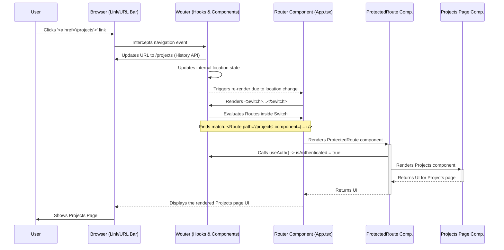

# Chapter 5: Frontend Routing (Wouter)

Welcome back! In the previous chapter, [Chapter 4: Database Interaction (Drizzle & Storage Abstraction)](04_database_interaction__drizzle___storage_abstraction_.md), we explored how our backend server talks to the database using Drizzle and a clever storage abstraction. Now, let's shift our focus back to the frontend – the part of the application users see and interact with in their web browser. How does the app know which "page" or view to show when you click a link or type a URL?

## What Problem Does This Solve? The App's GPS Analogy

Imagine our `Project-Finance-Tracker` application is like a big city with different districts: a Dashboard district, a Projects district, an Expenses district, a Settings district, and so on.

When you're using the app, you want to navigate between these districts easily. If you click on a "Projects" button, you expect to see the list of projects. If you type `/clients/5` in your browser's address bar, you expect to see the details for Client #5.

Without a navigation system:
*   Every click might force the entire website to reload from the server, which is slow and clunky.
*   The app wouldn't know how to show different content based on the URL.
*   It would be like a city with no road signs or GPS – you'd be stuck in one place!

**Frontend Routing** is the system that handles this navigation *within* the user's browser, without needing a full page reload for every change. It acts like the application's internal GPS. Our chosen GPS tool for this project is a library called **Wouter**.

Wouter looks at the current URL path (the part after the domain name, like `/projects` or `/expenses/123`) and decides which specific part of our application (which React component, representing a "page") should be displayed. It makes our application feel fast and responsive, like a modern web app (often called a Single Page Application or SPA).

**Our Goal (Use Case):** Let's say a user is logged in and on the main Dashboard (`/`). They want to see their list of projects.
1.  The user clicks a "Projects" link in the navigation menu.
2.  The URL in the browser address bar should change to `/projects`.
3.  The main content area of the application should *immediately* update to show the `Projects` page component, without reloading the entire website.
4.  Also, if a user *isn't* logged in and tries to go directly to `/projects`, they should be automatically redirected to the `/login` page instead.

## Key Concepts: The Wouter Navigation Toolkit

Let's look at the tools Wouter provides in our `client/src/App.tsx` file:

1.  **Wouter:** A small, simple, and hook-based routing library for React. Think of it as a lightweight GPS system specifically designed for modern React apps.

2.  **`<Route path="...">` Component:** This is like a specific road sign. It tells Wouter: "If the *current URL path* exactly matches the `path` prop (e.g., `path="/projects"`), then render the component specified in the `component` prop."

    ```typescript
    // Example from client/src/App.tsx (Simplified)
    import Projects from "@/pages/projects";
    import { Route } from "wouter";

    // ... inside the Router function ...

    // If the URL is exactly "/projects", show the Projects component
    <Route path="/projects" component={Projects} />
    ```
    *   This snippet defines that when the browser's URL path is `/projects`, Wouter should display the `Projects` page component.

3.  **`<Switch>` Component:** Imagine a set of branching roads where you can only take the *first* road that matches your destination. The `<Switch>` component wraps multiple `<Route>` components. Wouter looks through the `<Route>`s inside the `<Switch>` from top to bottom and renders *only the first one* whose `path` matches the current URL. This prevents multiple pages from accidentally rendering at the same time.

    ```typescript
    // Example from client/src/App.tsx (Simplified)
    import { Switch, Route } from "wouter";
    import Dashboard from "@/pages/dashboard";
    import Projects from "@/pages/projects";
    import NotFound from "@/pages/not-found"; // A page for unknown URLs

    // ... inside the Router function ...
    <Switch>
      <Route path="/" component={Dashboard} />
      <Route path="/projects" component={Projects} />
      {/* Add more routes here... */}

      {/* If none of the above match, show the NotFound page */}
      <Route component={NotFound} />
    </Switch>
    ```
    *   If the URL is `/`, the `Dashboard` component renders.
    *   If the URL is `/projects`, the `Projects` component renders.
    *   If the URL is something else (e.g., `/random`), *only* the `NotFound` component renders because it's the last `Route` without a specific path, acting as a catch-all.

4.  **URL Parameters (`:parameterName`)**: Sometimes, part of the URL is dynamic. For example, `/expenses/123` shows details for expense ID 123, while `/expenses/456` shows details for ID 456. Wouter lets us define routes with parameters using a colon (`:`).

    ```typescript
    // Example from client/src/App.tsx (Simplified)
    import ExpenseDetails from "@/pages/expense-details";
    import { Route } from "wouter";

    // ... inside the Router function ...

    // Matches URLs like /expenses/1, /expenses/99, /expenses/abc
    <Route path="/expenses/:id" component={ExpenseDetails} />
    ```
    *   This route matches any URL starting with `/expenses/` followed by some value. That value will be available inside the `ExpenseDetails` component as a parameter named `id`. We'll see how components access these parameters in [Chapter 6: Data Fetching & State (React Query)](06_data_fetching___state__react_query_.md).

5.  **`useLocation()` hook & `navigate()` function:** What if we need to change the page programmatically, like redirecting a user after they log in? Wouter provides the `useLocation` hook. We typically extract the `navigate` function from it. Calling `navigate('/some/path')` tells Wouter to update the URL and render the corresponding route, just like clicking a link.

    ```typescript
    // Example from a component like LoginForm (Simplified)
    import { useLocation } from "wouter";

    function LoginForm() {
      const [, navigate] = useLocation(); // Get the navigate function

      async function handleLoginSuccess() {
        // ... perform login logic ...
        // After successful login, redirect to the dashboard
        navigate("/");
      }
      // ... rest of component
    }
    ```
    *   When `handleLoginSuccess` runs, it calls `navigate('/')`, which changes the browser URL to `/` and causes Wouter to render the component associated with the `/` path (likely the `Dashboard`).

6.  **Protected Routes (`ProtectedRoute`):** We don't want just anyone accessing pages like `/projects` or `/settings`. We need to combine routing with the authentication status we learned about in [Chapter 2: Authentication & Authorization](02_authentication___authorization_.md). We create a special wrapper component (`ProtectedRoute`) that checks if the user is logged in before rendering the actual page component.

    ```typescript
    // Simplified version of client/src/App.tsx ProtectedRoute
    import { useAuth } from "@/hooks/useAuth";
    import { useLocation } from "wouter";

    function ProtectedRoute({ component: Component, ...rest }: any) {
      const { isAuthenticated, isLoading } = useAuth(); // Get auth status
      const [, navigate] = useLocation();

      if (isLoading) return <div>Loading...</div>; // Wait while checking auth

      if (!isAuthenticated) {
        // If not logged in, redirect to the login page
        navigate("/login");
        return null; // Don't render the protected component
      }

      // If logged in, render the intended page component
      return <Component {...rest} />;
    }
    ```
    *   This component uses the `useAuth` hook. If the user isn't authenticated, it uses `navigate` to send them to `/login`. Otherwise, it renders the component it was supposed to protect (passed as `Component`).

## Solving the Use Case: Setting Up Navigation

Let's see how `client/src/App.tsx` uses these concepts to handle our use case (navigating from `/` to `/projects` and protecting `/projects`).

```typescript
// Simplified structure of client/src/App.tsx

import { Switch, Route, useLocation } from "wouter";
import Dashboard from "@/pages/dashboard";
import Projects from "@/pages/projects";
import ExpenseDetails from "@/pages/expense-details";
import Login from "@/pages/login";
import NotFound from "@/pages/not-found";
// Import our custom ProtectedRoute component (defined earlier)
// ... other imports ...
import { useAuth } from "@/hooks/useAuth"; // Needed by ProtectedRoute


// Protected Route component (explained above)
function ProtectedRoute({ component: Component, ...rest }: any) {
  // ... implementation from previous section ...
}

// The main Router component
function Router() {
  // We check isAuthenticated here to potentially hide parts of the UI,
  // but the core protection happens INSIDE ProtectedRoute.
  const { isAuthenticated } = useAuth();

  return (
    <Switch>
      {/* Public routes */}
      <Route path="/login" component={Login} />
      {/* <Route path="/register" component={Register} /> */}

      {/* Routes that require login */}
      {/* We wrap protected components with ProtectedRoute */}
      <Route path="/" component={() => <ProtectedRoute component={Dashboard} />} />
      <Route path="/projects" component={() => <ProtectedRoute component={Projects} />} />
      {/* Example with parameters */}
      <Route path="/expenses/:id" component={() => <ProtectedRoute component={ExpenseDetails} />} />
      {/* Add other protected routes here... */}


      {/* Fallback for any URL not matched above */}
      <Route component={NotFound} />
    </Switch>
  );
}

// The main App component wraps everything
function App() {
  return (
    // AuthProvider makes useAuth work (from Chapter 2)
    // QueryClientProvider is for data fetching (Chapter 6)
    // <QueryClientProvider client={queryClient}>
      <AuthProvider>
        <Router /> {/* Render our routes */}
        {/* <Toaster /> ... other global components */}
      </AuthProvider>
    // </QueryClientProvider>
  );
}

export default App;
```

**Explanation:**

1.  **Structure:** The main `App` component sets up providers (like `AuthProvider` needed for `useAuth`). It then renders the `Router` component.
2.  **`<Switch>`:** The `Router` uses a `<Switch>` to ensure only one route matches.
3.  **Public Routes:** `/login` and `/register` are defined first. They don't need `ProtectedRoute` because anyone should be able to access them.
4.  **Protected Routes:** Routes like `/` (Dashboard) and `/projects` are defined next. Notice how their `component` prop renders our `ProtectedRoute` component, passing the *actual* page component (`Dashboard` or `Projects`) to it.
    *   When the user navigates to `/projects`:
        *   Wouter matches `<Route path="/projects" ...>`.
        *   It tries to render `ProtectedRoute` with `component={Projects}`.
        *   `ProtectedRoute` checks `useAuth()`:
            *   If logged in (`isAuthenticated` is true), it renders the `Projects` component.
            *   If *not* logged in, it calls `navigate("/login")`, causing Wouter to re-evaluate and match the `<Route path="/login" ...>` instead, showing the `Login` component.
5.  **Route with Parameter:** The route `/expenses/:id` is also protected and will render `ExpenseDetails`. The `ExpenseDetails` component will be able to access the specific `id` from the URL.
6.  **Fallback:** The final `<Route component={NotFound} />` catches any URL that didn't match the routes above it, showing a "Page Not Found" message.

This setup effectively solves our use case: navigating between pages is handled by Wouter, and access control is managed by the `ProtectedRoute` component working with `useAuth`.

## How It Works Internally: The Navigation Flow

Let's trace what happens when a logged-in user clicks a link pointing to `/projects`.

**Step-by-Step (Clicking the "Projects" Link):**

1.  **User Action:** The user clicks an HTML link element (e.g., `<a href="/projects">Projects</a>`). Wouter automatically intercepts clicks on standard links.
2.  **Wouter Intercepts:** Instead of letting the browser do a full page reload, Wouter captures the navigation intent.
3.  **URL Update:** Wouter updates the browser's address bar to show `http://your-app.com/projects` using the browser's History API (this doesn't trigger a page load).
4.  **State Change:** Wouter updates its internal state to reflect the new location (`/projects`).
5.  **Re-render Triggered:** This state change causes the `Router` component (or components using Wouter hooks like `useLocation`) to re-render.
6.  **`<Switch>` Evaluation:** The `<Switch>` component inside `Router` re-evaluates its children:
    *   Does `/projects` match `/login`? No.
    *   Does `/projects` match `/`? No.
    *   Does `/projects` match `/projects`? **Yes!**
7.  **Render Matching `<Route>`:** The `<Switch>` decides to render the component specified for the matching route: `() => <ProtectedRoute component={Projects} />`.
8.  **`ProtectedRoute` Check:** The `ProtectedRoute` component renders.
    *   It calls `useAuth()` and finds `isAuthenticated` is `true`.
    *   It proceeds to render the component passed to it: `<Projects />`.
9.  **Page Display:** The `Projects` page component is rendered onto the screen, replacing the previous page's content (e.g., the `Dashboard`). The user sees the projects list.

**Sequence Diagram (Simplified):**



This diagram shows how Wouter sits between the user's action and the rendering of the final page component, coordinating with `ProtectedRoute` to ensure access control.

## Conclusion

In this chapter, we learned about **Frontend Routing** and how we use the **Wouter** library to manage navigation within our `Project-Finance-Tracker` application.

*   We saw that frontend routing allows users to move between different "pages" or views without requiring a full website reload, creating a smoother **Single Page Application (SPA)** experience.
*   We explored Wouter's key tools:
    *   `<Route>` to map URL paths to components.
    *   `<Switch>` to render only the first matching route.
    *   URL parameters (`:id`) for dynamic routes.
    *   `navigate` function for programmatic navigation.
*   We implemented **Protected Routes** using a custom `ProtectedRoute` component that works with the `useAuth` hook from [Chapter 2: Authentication & Authorization](02_authentication___authorization_.md) to restrict access to logged-in users only.

Now that we can navigate between different pages and protect them, how do these pages actually get the data they need to display? How does the `Projects` page fetch the list of projects from the backend API we built?

Let's move on to explore how we handle fetching data from the server and managing that data's state within our frontend components.

**Next:** [Chapter 6: Data Fetching & State (React Query)](06_data_fetching___state__react_query_.md)

---

Generated by [AI Codebase Knowledge Builder](https://github.com/The-Pocket/Tutorial-Codebase-Knowledge)