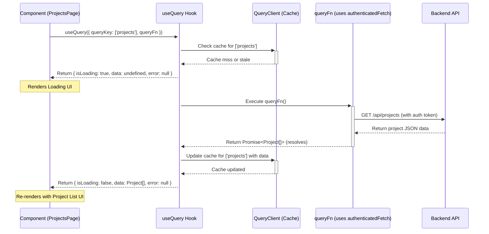

# Chapter 6: Data Fetching & State (React Query)

Welcome back! In [Chapter 5: Frontend Routing (Wouter)](05_frontend_routing__wouter_.md), we learned how users navigate between different pages in our application. Now, when a user lands on a page like "Projects" or the "Dashboard", how does that page get the actual data (like the list of projects or recent expenses) it needs to display? And how does it handle things like loading spinners or error messages while waiting for that data?

## What Problem Does This Solve? The Forgetful Assistant Analogy

Imagine you have an assistant helping you manage your project finances. You ask them, "Can you get me the list of current projects?"

A very basic, forgetful assistant might:
1.  Go to the filing cabinet (the backend API) and get the list.
2.  Give it to you.
3.  *Immediately forget* they just did that.

If you ask again 5 minutes later, they go through the *entire process* again. What if the filing cabinet is slow to open (the network is slow)? You have to wait... again. What if they trip and drop the files (a network error occurs)? You get nothing and have to ask again manually. What if the list hasn't even changed? They still fetch it fresh every single time.

This is similar to manually fetching data in a web application. For every piece of data needed:
*   You have to write code to *start* the request.
*   You need to manually track if the data is currently *loading* (to show a spinner).
*   You need to manually track if an *error* occurred (to show an error message).
*   You need to store the *actual data* once it arrives.
*   You have no built-in way to avoid re-fetching unchanged data or automatically updating it in the background.

This gets complicated very quickly, especially with multiple data points on a single page!

**React Query** is like hiring a super-smart, organized **Librarian** for your application's data.
*   You ask the Librarian (`useQuery` hook) for specific information (e.g., 'the list of projects').
*   The Librarian knows how to fetch it (`queryFn` using `authenticatedFetch`).
*   It automatically tells you if it's still fetching (`isLoading`).
*   It tells you if something went wrong (`error`).
*   It gives you the data when ready (`data`).
*   Crucially, it **remembers** (caches) what it fetched. If you ask for the same data again soon after, it gives you the remembered copy instantly while checking in the background if a newer version is available.
*   It can automatically refetch data when needed (e.g., when the user switches back to the browser tab).

This makes our component code much cleaner and the user experience much smoother.

**Our Goal (Use Case):** When the user navigates to the `Projects` page (using the routing from Chapter 5), we want to:
1.  Fetch the list of projects from the backend API endpoint `/api/projects`.
2.  Show a loading indicator while the data is being fetched.
3.  If an error occurs, display an error message.
4.  Once the data arrives, display the list of projects.
5.  Leverage caching so navigating away and back quickly doesn't always trigger a full reload wait time.

## Key Concepts: The React Query Toolkit

Let's explore the main tools React Query gives us:

1.  **The Problem Solver:** React Query manages the complexities of server state: fetching, caching, synchronizing, and updating data from your backend API without you needing to write lots of manual code for loading states, error states, or cache management.

2.  **`QueryClient` (`client/src/lib/queryClient.ts` - The Central Library):**
    *   This is the heart of React Query on the frontend. It's the central object that manages the cache (where the "remembered" data is stored) and coordinates all the data fetching operations.
    *   You typically create *one* instance of this client for your entire application.

    ```typescript
    // Simplified snippet from client/src/lib/queryClient.ts
    import { QueryClient } from "@tanstack/react-query";
    // We'll discuss the default queryFn later

    export const queryClient = new QueryClient({
      defaultOptions: {
        queries: {
          // Default settings for all queries (can be overridden)
          staleTime: 5 * 60 * 1000, // Data is considered fresh for 5 minutes
          // queryFn: ... // We can set a default fetching function here
        },
      },
    });
    ```
    *   This code creates the main `queryClient` instance. We've set a default `staleTime`, meaning React Query will serve cached data for up to 5 minutes before considering it "stale" (potentially needing a background refresh).

3.  **`QueryClientProvider` (Making the Library Available):**
    *   To use React Query hooks in your components, they need access to the `QueryClient`. The `QueryClientProvider` component wraps your application (usually in `App.tsx` or `main.tsx`) and makes the client available.

    ```typescript
    // Simplified snippet from client/src/main.tsx or App.tsx
    import React from 'react';
    import ReactDOM from 'react-dom/client';
    import App from './App';
    import { QueryClientProvider } from '@tanstack/react-query';
    import { queryClient } from './lib/queryClient'; // Import our client
    import { AuthProvider } from './hooks/useAuth'; // From Chapter 2

    ReactDOM.createRoot(document.getElementById('root')!).render(
      <React.StrictMode>
        {/* Provide the client to the entire app */}
        <QueryClientProvider client={queryClient}>
          {/* AuthProvider needed for authenticatedFetch */}
          <AuthProvider>
            <App />
          </AuthProvider>
        </QueryClientProvider>
      </React.StrictMode>,
    );
    ```
    *   This ensures that any component within `<App />` can now use React Query hooks like `useQuery`. Note that `AuthProvider` is also included here because our data fetching needs `authenticatedFetch`.

4.  **`useQuery` Hook (Asking the Librarian):**
    *   This is the main hook your components will use to fetch and subscribe to data. You tell it *what* data you need and *how* to fetch it.

    ```typescript
    // Inside a React component, e.g., ProjectsPage.tsx
    import { useQuery } from "@tanstack/react-query";
    import { useAuth } from "@/hooks/useAuth"; // To get authenticatedFetch
    import { Project } from "@shared/schema"; // Type from Chapter 1

    function ProjectsPage() {
      const { authenticatedFetch } = useAuth(); // Get secure fetch function

      // 👇 Use the useQuery hook
      const { data, isLoading, error } = useQuery<Project[]>({
        // 1. queryKey: Unique identifier for this data
        queryKey: ['projects'],

        // 2. queryFn: Async function that fetches the data
        queryFn: async () => {
          const response = await authenticatedFetch("GET", "/api/projects");
          if (!response.ok) {
            throw new Error(`Network response was not ok: ${response.statusText}`);
          }
          return response.json(); // Parse the JSON data
        },
      });

      // ... render based on isLoading, error, data ...
    }
    ```
    *   This hook fetches data for the 'projects' key using our secure `authenticatedFetch`. It automatically provides `data`, `isLoading`, and `error` states.

5.  **`queryKey` (The Library Call Number):**
    *   An array that uniquely identifies the data you want to fetch. React Query uses this key for caching.
    *   Simple lists: `['projects']`, `['clients']`
    *   Specific item: `['projects', projectId]` (where `projectId` is a variable)
    *   Data with filters: `['expenses', { status: 'pending', page: 2 }]`
    *   If any part of the key changes, React Query treats it as a request for different data.

6.  **`queryFn` (The Fetching Instructions):**
    *   An asynchronous function that **must return a promise** which resolves with your data or throws an error.
    *   This is where you put your actual API call logic.
    *   Crucially, in our project, we use `authenticatedFetch` from our `useAuth` hook ([Chapter 2: Authentication & Authorization](02_authentication___authorization_.md)) inside the `queryFn` to make sure our requests to the backend are secure and include the necessary authentication token.

7.  **Return Values (`data`, `isLoading`, `error`):**
    *   `useQuery` returns an object with several helpful state variables:
        *   `isLoading`: `true` if this is the initial fetch for this `queryKey` and it hasn't finished yet. Useful for showing loading spinners. (Note: there's also `isFetching` which is true during background refetches).
        *   `error`: If the `queryFn` throws an error, this variable will contain the error object. Useful for showing error messages.
        *   `data`: If the fetch is successful, this variable will contain the data returned from your `queryFn`. Initially `undefined`.

8.  **Caching (The Librarian's Memory):**
    *   When `useQuery` successfully fetches data for a `queryKey`, it stores that data in the `QueryClient`'s cache.
    *   If another component (or the same component later) requests data with the *exact same* `queryKey`, React Query will:
        *   Instantly return the cached `data`.
        *   (Depending on `staleTime`) Potentially trigger a background refetch using the `queryFn` to check for updates. If new data arrives, it updates the cache and silently updates the component.

## Solving the Use Case: Fetching the Project List

Let's implement the `Projects` page using `useQuery` to fetch and display the project list.

```typescript
// Simplified structure for: client/src/pages/projects.tsx

import { useQuery } from "@tanstack/react-query";
import { useAuth } from "@/hooks/useAuth";
import { Project } from "@shared/schema"; // Shared data type
import { Skeleton } from "@/components/ui/skeleton"; // Loading indicator
import { Alert, AlertDescription, AlertTitle } from "@/components/ui/alert"; // Error display
import { Link } from "wouter";

export default function ProjectsPage() {
  const { authenticatedFetch } = useAuth();

  // Use useQuery to fetch projects
  const {
    data: projects, // Will hold the array of Project objects on success
    isLoading,     // True while fetching for the first time
    error,         // Holds the error object if the fetch fails
  } = useQuery<Project[], Error>({ // Specify expected data and error types
    queryKey: ['projects'], // Unique key for "all projects"
    queryFn: async () => {
      // Use the authenticated fetch function from useAuth
      const response = await authenticatedFetch("GET", "/api/projects");
      if (!response.ok) {
        // Throw an error if the API response is not OK
        throw new Error(`Failed to fetch projects: ${response.statusText}`);
      }
      // Parse the JSON response and return it
      return await response.json();
    },
    // Optional: configure staleTime, cacheTime etc. here if needed
    // staleTime: 1000 * 60 * 5, // Example: 5 minutes
  });

  // 1. Handle Loading State
  if (isLoading) {
    return (
      <div className="p-4 space-y-2">
        <Skeleton className="h-8 w-1/4" /> {/* Placeholder for title */}
        <Skeleton className="h-10 w-full" /> {/* Placeholder for table row */}
        <Skeleton className="h-10 w-full" />
        <Skeleton className="h-10 w-full" />
      </div>
    );
  }

  // 2. Handle Error State
  if (error) {
    return (
      <Alert variant="destructive" className="m-4">
        <AlertTitle>Error</AlertTitle>
        <AlertDescription>
          Could not fetch projects: {error.message}
        </AlertDescription>
      </Alert>
    );
  }

  // 3. Handle Success State (Data is Available)
  return (
    <div className="p-4">
      <h1 className="text-2xl font-bold mb-4">Projects</h1>
      {projects && projects.length > 0 ? (
        <ul>
          {projects.map((project) => (
            <li key={project.id} className="mb-2 border p-2 rounded hover:bg-gray-50">
              <Link href={`/projects/${project.id}`}>
                <a className="text-blue-600 hover:underline">{project.name}</a>
              </Link>
              <span className={`ml-2 px-2 py-0.5 text-xs rounded-full ${
                project.status === 'completed' ? 'bg-green-100 text-green-800' : 'bg-yellow-100 text-yellow-800'
              }`}>
                {project.status}
              </span>
            </li>
          ))}
        </ul>
      ) : (
        <p>No projects found.</p>
      )}
    </div>
  );
}
```

**Explanation:**

1.  **Fetch with `useQuery`:** We call `useQuery` with `queryKey: ['projects']` and a `queryFn` that uses `authenticatedFetch` to GET `/api/projects`. We specify the expected data type (`Project[]`) and error type (`Error`).
2.  **Loading State:** While `isLoading` is true, we render simple placeholder elements (Skeletons).
3.  **Error State:** If `error` is not null, we render an Alert component showing the error message.
4.  **Success State:** If neither `isLoading` nor `error` is true, we know `projects` (our `data`) should be available. We check if `projects` has data and either map over it to display the list (linking each project name to its detail page using Wouter's `<Link>`) or show a "No projects found" message.

React Query handles all the underlying state transitions for us!

## How It Works Internally: The Librarian's Process

Let's follow the Librarian (`useQuery`) when the `ProjectsPage` component mounts and asks for project data.

**Step-by-Step (Asking for Projects):**

1.  **Component Mounts:** `ProjectsPage` renders for the first time.
2.  **`useQuery` Called:** The `useQuery({ queryKey: ['projects'], queryFn: ... })` hook executes.
3.  **Check Cache:** `useQuery` asks the central `QueryClient` (the library): "Do you have fresh data for the key `['projects']`?"
4.  **Cache Miss (First Time):** Since it's the first time, the cache is empty (or the data is considered "stale" based on `staleTime`). `useQuery` sets `isLoading` to `true` and returns `{ isLoading: true, error: null, data: undefined }`.
5.  **Component Renders Loading:** The component receives `isLoading: true` and renders the loading skeletons.
6.  **Fetch Data:** In the background, `useQuery` now calls the `queryFn` you provided.
7.  **`authenticatedFetch` Runs:** The `queryFn` calls `authenticatedFetch("GET", "/api/projects")`. This function (from `useAuth`) gets the JWT token, adds it to the headers, and sends the request to the backend API ([Chapter 3: Server API Structure (Express, Controllers, Services)](03_server_api_structure__express__controllers__services_.md)).
8.  **Backend Responds:** The backend processes the request, fetches data from the database ([Chapter 4: Database Interaction (Drizzle & Storage Abstraction)](04_database_interaction__drizzle___storage_abstraction_.md)), and sends back the list of projects as JSON.
9.  **Parse Response:** `authenticatedFetch` receives the response. The `queryFn` checks if `response.ok` is true. If yes, it parses the JSON using `response.json()`. If not, it throws an error.
10. **Data Resolved/Error Thrown:** The promise returned by `queryFn` either resolves with the `projects` array or rejects with an `Error`.
11. **Update Cache & State:**
    *   **On Success:** `useQuery` receives the resolved `projects` array. It stores this data in the `QueryClient` cache under the key `['projects']`. It then sets `isLoading` to `false` and updates `data`.
    *   **On Error:** `useQuery` catches the error thrown by `queryFn`. It stores the error information. It sets `isLoading` to `false` and updates `error`.
12. **Component Re-renders:** Because the state returned by `useQuery` has changed (`isLoading` is now false, and either `data` or `error` is populated), the `ProjectsPage` component re-renders.
13. **Display Result:** The component now renders either the project list (using `data`) or the error message (using `error`).

**Sequence Diagram (Simplified `useQuery` Flow):**



This diagram shows the component initiating the query, the hook checking the cache, executing the fetch function (which calls the API), updating the cache on success, and finally returning the data to the component, causing a re-render.

## Deeper Dive into Key Files

1.  **`client/src/lib/queryClient.ts` (Central Configuration):**
    *   This file sets up the `QueryClient` instance and can define *default* options for all queries.
    *   It often includes a default `queryFn` that automatically uses `authenticatedFetch`, reducing boilerplate in individual components.

    ```typescript
    // More complete snippet from client/src/lib/queryClient.ts
    import { QueryClient, QueryFunction } from "@tanstack/react-query";
    import { authenticatedFetch } from "@/hooks/useAuth"; // Assume we can import this

    // Default fetcher using authenticatedFetch
    const defaultQueryFn: QueryFunction = async ({ queryKey }) => {
      // Assume the first element of queryKey is the URL path
      const apiUrl = queryKey[0] as string;
      const response = await authenticatedFetch("GET", apiUrl); // Use GET by default

      if (!response.ok) {
        throw new Error(`Network response was not ok for ${apiUrl}: ${response.statusText}`);
      }
      return response.json();
    };

    export const queryClient = new QueryClient({
      defaultOptions: {
        queries: {
          // 👇 Use our default fetcher for all queries unless overridden
          queryFn: defaultQueryFn,
          staleTime: 1000 * 60, // 1 minute stale time default
          refetchOnWindowFocus: true, // Refetch when browser tab gets focus
        },
      },
    });
    ```
    *   By setting a `defaultQueryFn`, components might only need to specify the `queryKey` if the URL matches the key and it's a simple GET request, like `useQuery({ queryKey: ['/api/projects'] })`. Our example above defined `queryFn` explicitly for clarity.

2.  **Component using `useQuery` (Example: `client/src/components/dashboard/budget-chart.tsx`):**
    *   Many components across the application use `useQuery` to fetch their specific data needs. The dashboard charts and tables are prime examples.

    ```typescript
    // Simplified snippet from client/src/components/dashboard/budget-chart.tsx
    import { useQuery } from "@tanstack/react-query";
    import { useAuth } from "@/hooks/useAuth";
    // ... other imports for chart library ...

    export function BudgetChart() {
      const { authenticatedFetch } = useAuth();

      // Fetch data specifically for this chart's API endpoint
      const { data, isLoading, error } = useQuery({
        queryKey: ['/api/analytics/total-budget-vs-spent'], // Key matches API endpoint
        queryFn: async () => {
          const res = await authenticatedFetch("GET", '/api/analytics/total-budget-vs-spent');
          if (!res.ok) {
            throw new Error("Failed to fetch budget data");
          }
          return res.json();
        },
        staleTime: 60000 // Example: Custom stale time for this query
      });

      // ... Render chart based on isLoading, error, data ...
      // Example: transform 'data' into format needed by chart library
      const chartData = data?.map(/* ... transformation ... */) || [];

      if (isLoading) return <p>Loading Chart...</p>;
      if (error) return <p>Error loading chart: {error.message}</p>;

      return (
        <ResponsiveContainer /* ... chart config ... */>
          <BarChart data={chartData} /* ... */ >
            {/* ... chart elements ... */}
          </BarChart>
        </ResponsiveContainer>
      );
    }
    ```
    *   This shows another practical example. The `BudgetChart` component uses `useQuery` to get its data from `/api/analytics/total-budget-vs-spent`, handles loading/error states, and then formats the successful `data` for the charting library.

## Conclusion

In this chapter, we learned how **React Query** acts as our frontend's data "Librarian", simplifying how we fetch and manage data from our backend API.

*   We saw that manually handling loading states, error states, and caching for API data is complex.
*   React Query, configured with a `QueryClient` and made available via `QueryClientProvider`, solves this.
*   Components use the `useQuery` hook, providing a unique `queryKey` and an asynchronous `queryFn` (which uses `authenticatedFetch` for security).
*   `useQuery` automatically provides `isLoading`, `error`, and `data` variables, making it easy to render different UI states.
*   React Query handles caching, background updates, and refetching, leading to cleaner code and a more responsive user experience.

Now that our components can fetch and manage the data they need, how do we actually build the visual parts – the buttons, tables, cards, and layout – that display this data to the user?

Let's dive into the components that make up our user interface.

**Next:** [Chapter 7: UI Components (Shadcn/ui & Custom)](07_ui_components__shadcn_ui___custom_.md)

---

Generated by [AI Codebase Knowledge Builder](https://github.com/The-Pocket/Tutorial-Codebase-Knowledge)