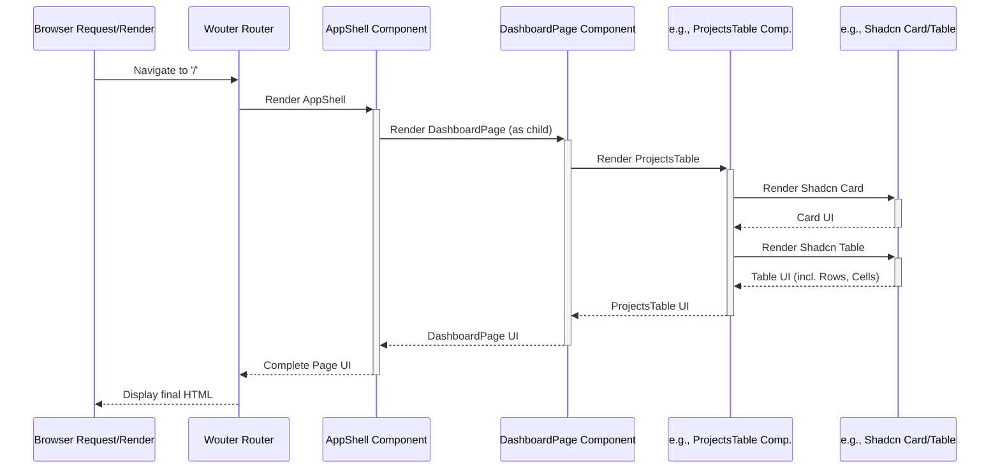

# Chapter 7: UI Components (Shadcn/ui & Custom)

Welcome back! In the previous chapter, [Chapter 6: Data Fetching & State (React Query)](06_data_fetching___state__react_query_.md), we learned how our frontend components fetch and manage the data they need to display using React Query. Now that we have the data, how do we actually build the visual elements – the buttons, cards, tables, and overall layout – that the user sees and interacts with?

## What Problem Does This Solve? The LEGO Bricks Analogy

Imagine building a large LEGO castle. You wouldn't create every single brick from scratch each time you need one! You'd use standard LEGO bricks: 2x4 red bricks, 1x2 blue bricks, roof pieces, window pieces, etc.

Building a user interface (UI) for an application is similar. We have common visual elements that appear repeatedly:
*   Buttons (Save, Cancel, Add New)
*   Cards (To display summaries or contained information)
*   Tables (To show lists of data like projects or expenses)
*   Forms (For user input)
*   Layout structures (Sidebars, headers)

If we coded each button or card individually every time we needed one:
*   It would be incredibly repetitive and time-consuming.
*   Slight differences would creep in (different colors, sizes, spacing), making the application look messy and inconsistent.
*   Updating the style of all buttons would be a nightmare!

**UI Components** are like our LEGO bricks. They are reusable, self-contained pieces of the user interface that we can assemble to build complex pages. This makes development faster, ensures consistency, and makes the application easier to maintain.

**Our Goal (Use Case):** Look at the main Dashboard page of our `Project-Finance-Tracker`. It displays various pieces of information using different visual elements:
*   An overall page structure with a sidebar for navigation.
*   Cards summarizing key statistics (like "Active Projects").
*   A table showing recent projects.
*   Maybe a chart visualizing budget data.

Our goal is to understand how these visual pieces are built using predefined "bricks" and how they are combined to create the complete Dashboard page.

## Key Concepts: Our UI Toolkit

Let's break down the types of UI components we use in this project:

1.  **UI Components as Building Blocks:** Think of each component as a specific type of LEGO brick. A `<Button>` component is one type of brick, a `<Card>` is another, a `<Sidebar>` is a larger, more complex assembly of bricks. We build our pages by combining these bricks. The key benefits are **reusability** (use the same Button brick everywhere) and **consistency** (all Button bricks look and behave the same).

2.  **Shadcn/ui (`client/src/components/ui/*` - The Basic Bricks):**
    *   This is a fantastic collection of foundational UI components. Think of these as the standard, high-quality LEGO bricks – Buttons, Cards, Input fields, Tables, Select dropdowns, etc.
    *   They are located in the `client/src/components/ui/` directory.
    *   They provide styling (using Tailwind CSS - see `tailwind.config.ts`) and accessibility features out of the box.
    *   You typically *use* these components as building blocks *inside* your own custom components. You usually don't modify the files in `components/ui/` directly, but rather compose them.

    ```typescript
    // Example: Using Shadcn/ui Button and Card inside another component
    import { Button } from "@/components/ui/button"; // Import the Button brick
    import { Card, CardHeader, CardTitle, CardContent } from "@/components/ui/card"; // Import Card bricks

    function MySimpleComponent() {
      return (
        <Card className="w-60"> {/* Use the Card brick */}
          <CardHeader>
            <CardTitle>Action Needed</CardTitle> {/* Use the CardTitle brick */}
          </CardHeader>
          <CardContent>
            <p>Please review the latest report.</p>
            <Button onClick={() => alert("Reviewing!")} className="mt-4"> {/* Use the Button brick */}
              Review Report
            </Button>
          </CardContent>
        </Card>
      );
    }
    ```
    *   This example shows how we import `Button` and `Card` components from `components/ui` and use them to structure a small piece of UI.

3.  **Custom Components (`client/src/components/layout/*`, `client/src/components/dashboard/*`, etc. - The Assembled Structures):**
    *   These are components we build ourselves *using* the basic Shadcn/ui bricks or other custom components. They serve specific purposes in our application.
    *   **Layout Components (`client/src/components/layout/*`):** These define the overall structure of our pages.
        *   `AppShell.tsx`: The main container that often includes the sidebar and the main content area.
        *   `Sidebar.tsx`: The navigation menu on the left side.
        *   `MobileNav.tsx`: The navigation adapted for smaller screens.
        *   They ensure that all pages have the same consistent framing.
    *   **Feature/Page Components (`client/src/components/dashboard/*`, `client/src/components/projects/*`, etc.):** These are components built for specific features or sections of the application.
        *   `StatsOverview.tsx`: A component on the dashboard showing multiple summary cards. It likely uses Shadcn `Card` components internally.
        *   `ProjectsTable.tsx`: A component displaying the list of projects in a table. It likely uses Shadcn `Table`, `Card`, `Button`, and `Progress` components internally.
        *   `BudgetChart.tsx`: A component displaying a chart. It uses a charting library combined with a Shadcn `Card` for framing.

    ```typescript
    // Example: How ProjectsTable might use Shadcn Table (Simplified)
    import { Card } from "@/components/ui/card";
    import { Table, TableBody, TableCell, TableHead, TableHeader, TableRow } from "@/components/ui/table";
    // ... other imports like Button, Progress ...

    // Assume 'projects' data is fetched via React Query (Chapter 6)
    function ProjectsTable({ projects }: { projects: any[] }) {
      return (
        <Card> {/* Use Shadcn Card for framing */}
          {/* ... Card Header ... */}
          <Table> {/* Use Shadcn Table */}
            <TableHeader>
              <TableRow>
                <TableHead>Name</TableHead> {/* Use Shadcn TableHead */}
                <TableHead>Status</TableHead>
                {/* ... other headers */}
              </TableRow>
            </TableHeader>
            <TableBody>
              {projects.map((project) => (
                <TableRow key={project.id}> {/* Use Shadcn TableRow */}
                  <TableCell>{project.name}</TableCell> {/* Use Shadcn TableCell */}
                  <TableCell>{project.status}</TableCell>
                  {/* ... other cells (maybe with Button or Progress) */}
                </TableRow>
              ))}
            </TableBody>
          </Table>
          {/* ... Card Footer / Pagination ... */}
        </Card>
      );
    }
    ```
    *   This shows a custom component (`ProjectsTable`) that uses multiple Shadcn/ui components (`Card`, `Table`, `TableRow`, etc.) to create a specific feature for our application.

4.  **Consistency through Composition:** By building our UI from these reusable Shadcn/ui bricks and well-defined custom components, we achieve a consistent look and feel across the entire application. Styling is managed centrally (primarily via Tailwind CSS and the definitions in `tailwind.config.ts`), and components behave predictably everywhere they are used.

## Solving the Use Case: Building the Dashboard

Let's revisit our Dashboard page and see how it's assembled using these components:

1.  **Overall Structure (`AppShell`):** When you navigate to the Dashboard route (`/`), the [Chapter 5: Frontend Routing (Wouter)](05_frontend_routing__wouter_.md) system renders the `DashboardPage` component *inside* the `AppShell` layout component. `AppShell` provides the consistent sidebar (using the `Sidebar` component) and the main content area where the `DashboardPage` will appear.

    ```typescript
    // Simplified idea from App.tsx or where routes are defined
    import { AppShell } from "@/components/layout/app-shell";
    import DashboardPage from "@/pages/dashboard"; // The actual page component

    function ProtectedRouteForDashboard() {
      // ... authentication check ...
      return (
        <AppShell> {/* AppShell provides the overall layout */}
          <DashboardPage /> {/* The specific page content goes inside */}
        </AppShell>
      );
    }
    ```

2.  **Dashboard Page Content (`DashboardPage`):** The `DashboardPage` component itself is responsible for arranging the specific elements seen on the dashboard.

    ```typescript
    // Simplified structure of client/src/pages/dashboard.tsx
    import { StatsOverview } from "@/components/dashboard/stats-overview";
    import { ProjectsTable } from "@/components/dashboard/projects-table";
    import { BudgetChart } from "@/components/dashboard/budget-chart";
    // ... other imports ...

    export default function DashboardPage() {
      return (
        <div className="p-4 space-y-4"> {/* Basic layout using Tailwind CSS */}
          <h1 className="text-2xl font-bold">Dashboard</h1>

          {/* Custom component for summary stats */}
          <StatsOverview />

          {/* Custom component for the projects table */}
          <ProjectsTable />

          {/* Custom component for the budget chart */}
          <BudgetChart />

          {/* ... Maybe other dashboard elements ... */}
        </div>
      );
    }
    ```
    *   The `DashboardPage` doesn't contain much direct HTML. Instead, it uses our custom dashboard components (`StatsOverview`, `ProjectsTable`, `BudgetChart`) to build the page.

3.  **Inside Custom Components (`StatsOverview`, `ProjectsTable`):** These custom components, in turn, use the basic Shadcn/ui bricks.
    *   `StatsOverview` likely uses multiple Shadcn `<Card>` components to display each statistic.
    *   `ProjectsTable` uses a `<Card>` to contain the table, and `<Table>`, `<TableRow>`, `<TableCell>`, `<Button>`, `<Progress>` etc. from Shadcn/ui to display the project data.

This hierarchical composition (Page -> Layout -> Feature Components -> Base UI Components) allows us to build complex interfaces from simple, reusable parts, just like building a LEGO castle.

## How It Works Internally: Component Composition

Building a page is like assembling LEGOs. You start with the base, add walls, then details.

**Step-by-Step (Rendering the Dashboard):**

1.  **Route Match:** Wouter matches the `/` path and decides to render the component responsible for the dashboard (let's assume it involves `AppShell` and `DashboardPage`).
2.  **`AppShell` Renders:** The `AppShell` component renders first. It sets up the main page structure, possibly rendering the `Sidebar` component (which itself might contain `NavItem` components using Shadcn `Button` or custom styled links). It leaves a designated area for the main page content (its `children`).
3.  **`DashboardPage` Renders:** Inside the content area provided by `AppShell`, the `DashboardPage` component renders.
4.  **Feature Components Render:** The `DashboardPage` renders its own children: `StatsOverview`, `ProjectsTable`, and `BudgetChart`.
5.  **`StatsOverview` Renders:** This component renders. Internally, it might loop through some data and render several Shadcn `<Card>` components. Each `<Card>` renders its own children (`<CardHeader>`, `<CardContent>`, potentially icons or text).
6.  **`ProjectsTable` Renders:** This component renders. It likely starts with a Shadcn `<Card>`. Inside that, it renders a Shadcn `<Table>` component, which renders `<TableHeader>`, `<TableBody>`. Inside the body, it maps over project data, rendering a `<TableRow>` for each project. Each `<TableRow>` renders multiple `<TableCell>` components, some of which might contain Shadcn `<Button>` or `<Progress>` components.
7.  **`BudgetChart` Renders:** This component renders, likely within a Shadcn `<Card>`, and uses a third-party charting library (like Recharts) to draw the actual chart visualization based on its fetched data.
8.  **Final Output:** The browser receives the combined HTML structure generated by this nested rendering process and displays the fully assembled Dashboard page.

**Sequence Diagram (Component Rendering Hierarchy):**


*This diagram simplifies the flow, showing how rendering starts from the outer layout (`AppShell`), goes down to the specific page (`DashboardPage`), then to feature components (`ProjectsTable`), which finally use the base UI elements (`Card`, `Table`) to generate the HTML.*

## Deeper Dive into Key Files

1.  **Shadcn/ui Components (`client/src/components/ui/*`)**:
    *   **Location:** `client/src/components/ui/`
    *   **Example:** `client/src/components/ui/button.tsx`
    *   **Purpose:** Provides the basic, styled building blocks. You import from here but rarely edit these files directly. They often wrap functionality from underlying libraries (like Radix UI) and apply styles via `cn` (a utility combining Tailwind classes).

    ```typescript
    // Simplified from client/src/components/ui/button.tsx
    import * as React from "react";
    import { Slot } from "@radix-ui/react-slot";
    import { cva, type VariantProps } from "class-variance-authority"; // For style variants
    import { cn } from "@/lib/utils"; // Tailwind class utility

    // Define button style variants (default, destructive, outline, etc.)
    const buttonVariants = cva(
      "inline-flex items-center justify-center ...", // Base Tailwind classes
      {
        variants: { /* ... variant styles ... */ },
        defaultVariants: { /* ... */ }
      }
    );

    // The actual Button component
    const Button = React.forwardRef<HTMLButtonElement, ButtonProps>(
      ({ className, variant, size, asChild = false, ...props }, ref) => {
        const Comp = asChild ? Slot : "button";
        return (
          <Comp
            // Apply combined styles based on variants and custom className
            className={cn(buttonVariants({ variant, size, className }))}
            ref={ref}
            {...props}
          />
        );
      }
    );
    // ... export Button, buttonVariants ...
    ```
    *   This shows how a Shadcn component defines different visual styles using `cva` and applies them using the `cn` utility.

2.  **Custom Layout Components (`client/src/components/layout/*`)**:
    *   **Location:** `client/src/components/layout/`
    *   **Example:** `client/src/components/layout/app-shell.tsx`
    *   **Purpose:** Define the overall page structure and navigation.

    ```typescript
    // Simplified structure of client/src/components/layout/app-shell.tsx
    import React from "react";
    import { Sidebar } from "./sidebar"; // Import the Sidebar component
    import { MobileNav } from "./mobile-nav"; // Import MobileNav

    interface AppShellProps {
      children: React.ReactNode; // To accept the main page content
    }

    export function AppShell({ children }: AppShellProps) {
      // ... state for mobile nav visibility ...

      return (
        <div className="min-h-screen flex flex-col md:flex-row">
          {/* Render mobile header/nav */}
          <MobileNav /* ... props ... */ />

          {/* Render desktop sidebar */}
          <Sidebar />

          {/* Main Content Area */}
          <main className="flex-1 overflow-x-hidden">
            {/* Render the actual page content passed in */}
            {children}
          </main>
        </div>
      );
    }
    ```
    *   `AppShell` includes the `Sidebar` and `MobileNav` components and provides a placeholder (`{children}`) where the content of the current page (like `DashboardPage`) will be rendered.

3.  **Custom Feature Components (`client/src/components/dashboard/*`, etc.)**:
    *   **Location:** `client/src/components/dashboard/`, `client/src/components/projects/`, etc.
    *   **Example:** `client/src/components/dashboard/projects-table.tsx`
    *   **Purpose:** Combine base UI elements and logic for specific application features.

    ```typescript
    // Simplified structure of client/src/components/dashboard/projects-table.tsx
    import { Card } from "@/components/ui/card"; // Use Shadcn Card
    import { Table, /* ... other table parts */ } from "@/components/ui/table"; // Use Shadcn Table
    import { Button } from "@/components/ui/button"; // Use Shadcn Button
    import { useQuery } from "@tanstack/react-query"; // Fetch data (Chapter 6)
    import { useAuth } from "@/hooks/useAuth"; // For authenticatedFetch (Chapter 2)
    // ... other imports ...

    export function ProjectsTable() {
      // ... Fetch project data using useQuery (like in Chapter 6) ...
      const { data: projects = [], isLoading } = useQuery(/* ... */);

      // ... Filtering and pagination logic ...

      return (
        <Card> {/* Wrap everything in a Card */}
          {/* ... Header with Title, Search Input, Filters (using Shadcn Input, Select) ... */}
          {isLoading ? (
            <p>Loading...</p>
          ) : (
            <Table> {/* Use the Shadcn Table */}
              {/* ... TableHeader ... */}
              <TableBody>
                {projects.map((project: any) => (
                  <TableRow key={project.id}>
                    <TableCell>{project.name}</TableCell>
                    {/* ... other TableCells using data and maybe Progress component ... */}
                    <TableCell>
                      <Button size="sm" variant="outline">View</Button> {/* Shadcn Button */}
                    </TableCell>
                  </TableRow>
                ))}
              </TableBody>
            </Table>
          )}
          {/* ... Footer with Pagination (using Shadcn Button) ... */}
        </Card>
      );
    }
    ```
    *   This shows how `ProjectsTable` acts as an intermediary: it fetches data (using concepts from Chapter 6) and then uses various Shadcn/ui components (`Card`, `Table`, `Button`, etc.) to display that data in a structured way.

## Conclusion

In this chapter, we learned about the importance of **UI Components** as the reusable building blocks of our application's interface, much like LEGO bricks.

*   We saw that using components promotes **reusability** and **consistency**.
*   **Shadcn/ui (`client/src/components/ui/*`)** provides our foundational set of styled, accessible components (Buttons, Cards, Tables, etc.).
*   **Custom Components** (`client/src/components/layout/*`, `client/src/components/dashboard/*`, etc.) assemble these base components and other custom components to create specific layouts and features (like the Sidebar, AppShell, ProjectsTable, StatsOverview).
*   We build complex pages by composing these components hierarchically.

With data fetching covered and our UI building blocks in place, one very common and important type of UI interaction is handling user input through forms. How do we build forms, validate the data entered, and handle submissions cleanly?

Let's move on to explore how we manage forms in our application.

**Next:** [Chapter 8: Forms Handling (React Hook Form & Zod)](08_forms_handling__react_hook_form___zod_.md)

---

Generated by [AI Codebase Knowledge Builder](https://github.com/The-Pocket/Tutorial-Codebase-Knowledge)