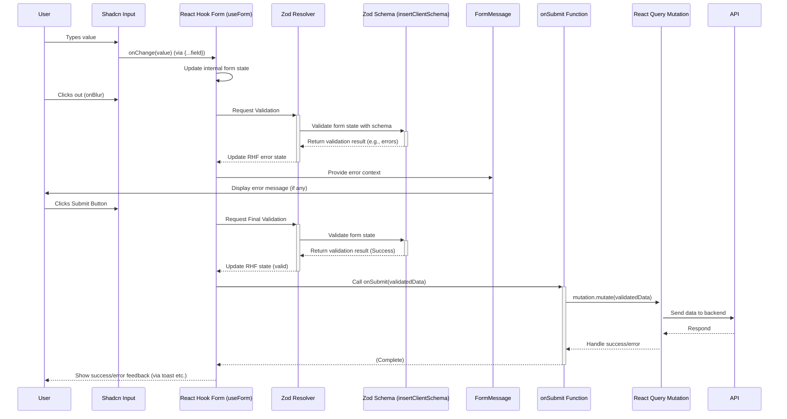

# Chapter 8: Forms Handling (React Hook Form & Zod)

Welcome to the final chapter! In [Chapter 7: UI Components (Shadcn/ui & Custom)](07_ui_components__shadcn_ui___custom_.md), we saw how to assemble the visual building blocks of our application using reusable components. Now, how do we handle one of the most common user interactions: filling out forms?

## What Problem Does This Solve? The Messy Paper Form Analogy

Imagine trying to apply for something using a complicated paper form with lots of fields and rules.
*   You might accidentally skip required fields.
*   You might enter information in the wrong format (like text where a number should be).
*   There's no immediate feedback if you make a mistake – you only find out when someone rejects the form later.
*   Keeping track of everything you've filled in can be messy.

Building forms in web applications can feel like this if we don't have good tools. We need to:
*   Keep track of what the user types in each field.
*   Check if the entered data is valid according to specific rules (e.g., is this a valid email? is this number positive?).
*   Show helpful error messages right next to the field if the user makes a mistake.
*   Know when the form is ready to be submitted.
*   Gather all the valid data easily when the user clicks "Submit".

Doing all this manually for every form is repetitive, error-prone, and can lead to messy code.

**React Hook Form** and **Zod** work together to provide a clean, efficient, and reliable way to handle forms in our React application. They act like a smart online form system that guides the user and ensures the data is correct before submission.

**Our Goal (Use Case):** Let's focus on the "Create New Client" feature. We need a form (`ClientCreateForm.tsx`) where the user can enter the client's name, contact person, email, and phone number.
1.  The form should use the validation rules we defined in our [Chapter 1: Shared Data Schema](01_shared_data_schema_.md) (`insertClientSchema`).
2.  If the user leaves the name blank or enters an invalid email, an error message should appear instantly below the respective field.
3.  Once the user fills in all required fields correctly and clicks "Create Client", the form should gather the valid data and send it to our backend API (likely triggering a mutation via React Query, as seen in [Chapter 6: Data Fetching & State (React Query)](06_data_fetching___state__react_query_.md)).

## Key Concepts: The Form Handling Dream Team

Let's meet the tools that make form handling easier:

1.  **The Challenge:** Managing form state (values, errors, touched fields, submission status) and validation logic manually is complex and often leads to performance issues or bugs.

2.  **React Hook Form (`useForm` hook - The Form Assistant):**
    *   This is the core library we use for managing form state and logic. Think of it as an efficient assistant dedicated to handling everything about a specific form.
    *   It keeps track of what the user enters, which fields have been touched, any validation errors, and whether the form is currently being submitted.
    *   It's designed for performance, minimizing unnecessary re-renders of your component.
    *   You initialize it using the `useForm()` hook.

3.  **Zod (`insertClientSchema`, etc. from `schema.ts` - The Rulebook):**
    *   As we saw in [Chapter 1: Shared Data Schema](01_shared_data_schema_.md), Zod is used to define the *shape* and *validation rules* for our data.
    *   For forms, we use Zod schemas (like `insertClientSchema`) to specify rules like required fields (`.min(1)` or inferred from `notNull`), minimum lengths (`.min(2)`), email formats (`.email()`), number types (`.number()`), etc.
    *   The key benefit is that we use the *exact same schema* for validating forms on the frontend as we do for validating data on the backend API, ensuring consistency.

4.  **`@hookform/resolvers/zod` (`zodResolver` - The Bridge):**
    *   This is a small utility that connects our Zod "Rulebook" to our React Hook Form "Assistant".
    *   When we initialize `useForm`, we tell it to use the `zodResolver` along with our specific Zod schema (e.g., `insertClientSchema`).
    *   This tells React Hook Form: "Hey, whenever you need to validate the form data, use the rules defined in this Zod schema."

5.  **Shadcn/ui Form Components (`<Form>`, `<FormField>`, etc. - The Pre-printed Fields):**
    *   From [Chapter 7: UI Components (Shadcn/ui & Custom)](07_ui_components__shadcn_ui___custom_.md), Shadcn provides helpful components specifically designed to work with React Hook Form:
        *   `<Form>`: Wraps the entire form, providing context.
        *   `<FormField>`: Connects a specific input field in your UI (like Shadcn's `<Input>`) to the state managed by React Hook Form for a particular field name (e.g., "name", "contactEmail").
        *   `<FormItem>`, `<FormLabel>`, `<FormControl>`: Standard components to structure the label and input area within a `<FormField>`.
        *   `<FormMessage>`: **Crucially**, this component automatically displays the validation error message (if any) for the specific `<FormField>` it's placed within. It gets the error information directly from React Hook Form.

6.  **Submission Handling (`onSubmit`, React Query Mutations):**
    *   React Hook Form provides a way to define an `onSubmit` function that *only runs* if the form passes validation according to the Zod schema.
    *   Inside this `onSubmit` function, we typically take the validated form data and trigger an action, like calling a React Query `mutation` ([Chapter 6: Data Fetching & State (React Query)](06_data_fetching___state__react_query_.md)) to send the data to our backend API ([Chapter 3: Server API Structure (Express, Controllers, Services)](03_server_api_structure__express__controllers__services_.md)).

## Solving the Use Case: Creating a New Client Form

Let's look at how `client/src/components/forms/create-client-form.tsx` uses these concepts:

```typescript
// Simplified snippet from client/src/components/forms/create-client-form.tsx

import { useForm } from "react-hook-form";
import { zodResolver } from "@hookform/resolvers/zod"; // The Bridge
import { z } from "zod";
import { insertClientSchema } from "@shared/schema"; // The Rulebook (from Chapter 1)
import { useMutation } from "@tanstack/react-query"; // For submission (Chapter 6)
import { Button } from "@/components/ui/button"; // UI brick (Chapter 7)
import { Input } from "@/components/ui/input"; // UI brick (Chapter 7)
import {
  Form, FormField, FormItem, FormLabel, FormControl, FormMessage, // Form UI bricks (Chapter 7)
} from "@/components/ui/form";
import { useAuth } from "@/hooks/useAuth"; // For authenticatedFetch & user ID (Chapter 2)
// ... other imports like toast, queryClient, Dialog ...

// Define the type of our form data based on the Zod schema
type ClientFormData = z.infer<typeof insertClientSchema>;

export function ClientCreateForm(/* ... props like open, onOpenChange ... */) {
  const { authenticatedFetch, user } = useAuth();
  // ... toast, queryClient ...

  // 1. Initialize the Form Assistant (useForm)
  const form = useForm<ClientFormData>({
    // Tell the assistant to use the Zod Rulebook via the Bridge
    resolver: zodResolver(insertClientSchema),
    defaultValues: { // Initial values for the form fields
      name: "",
      contactPerson: "",
      contactEmail: "",
      contactPhone: "",
      // createdById will be added during submission
    },
  });

  // 2. Setup the mutation for sending data to the backend (from Chapter 6)
  const createMutation = useMutation({
    mutationFn: async (data: ClientFormData) => {
      if (!user) throw new Error("User not authenticated");
      // Use authenticatedFetch to send data securely
      const res = await authenticatedFetch("POST", "/api/clients/create", {
        body: JSON.stringify({ ...data, createdById: user.id }), // Add user ID
        // ... headers ...
      });
      return res.json();
    },
    onSuccess: () => { /* ... show success toast, invalidate queries, close dialog ... */ },
    onError: () => { /* ... show error toast ... */ },
  });

  // 3. Define the submission handler
  // This function receives the 'values' ONLY if validation passes
  function onSubmit(values: ClientFormData) {
    console.log("✅ Form is valid! Submitting:", values);
    // Trigger the mutation with the validated data
    createMutation.mutate(values);
  }

  return (
    <Dialog /* ... open/onOpenChange props ... */>
      {/* ... Dialog Header ... */}
      {/* 4. Provide form context using Shadcn's <Form> */}
      <Form {...form}>
        {/* Use the onSubmit handler from RHF */}
        <form onSubmit={form.handleSubmit(onSubmit)} className="space-y-4">

          {/* 5. Define a field using <FormField> */}
          <FormField
            control={form.control} // Connects to RHF's control
            name="name" // Links to the 'name' field in the form state/schema
            render={({ field }) => ( // Renders the UI for this field
              <FormItem>
                <FormLabel>Client Name</FormLabel>
                <FormControl>
                  {/* Spread RHF props onto the Shadcn Input */}
                  <Input placeholder="ACME Corp" {...field} />
                </FormControl>
                {/* Magic! Shows Zod/RHF validation errors automatically */}
                <FormMessage />
              </FormItem>
            )}
          />

          {/* Repeat <FormField> for contactPerson, contactEmail, contactPhone... */}
          <FormField
            control={form.control}
            name="contactEmail"
            render={({ field }) => (
              <FormItem>
                <FormLabel>Contact Email</FormLabel>
                <FormControl>
                  <Input type="email" placeholder="contact@acme.com" {...field} />
                </FormControl>
                <FormMessage /> {/* Shows email format errors, required errors */}
              </FormItem>
            )}
          />

          {/* ... other fields ... */}

          {/* 6. Submit Button */}
          <Button type="submit" disabled={createMutation.isPending}>
            {createMutation.isPending ? "Creating..." : "Create Client"}
          </Button>
        </form>
      </Form>
      {/* ... Dialog Footer ... */}
    </Dialog>
  );
}
```

**Explanation:**

1.  **`useForm` Initialization:** We create our form "assistant" (`form`) using `useForm`. We link it to our `insertClientSchema` rulebook via the `zodResolver`. We also set initial empty values.
2.  **React Query Mutation:** We set up the `createMutation` (as seen in Chapter 6) which knows how to send the client data to our `/api/clients/create` endpoint using `authenticatedFetch`.
3.  **`onSubmit` Function:** We define what should happen when the form is valid and submitted. React Hook Form's `form.handleSubmit(onSubmit)` wrapper ensures this function *only* runs if Zod validation passes. Inside, we trigger our `createMutation`.
4.  **`<Form>` Component:** This Shadcn component wraps our form elements and provides the necessary context from React Hook Form (`form`) to its children.
5.  **`<FormField>` Component:** This is the key connector.
    *   `control={form.control}` links it to the RHF state.
    *   `name="name"` specifies which field this is for.
    *   The `render` prop gets an object (`field`) containing `value`, `onChange`, `onBlur`, etc., which we spread onto the actual `<Input>` component (`{...field}`). This automatically connects the input's changes to RHF.
    *   The `<FormMessage />` component magically displays validation errors for the "name" field if RHF detects any based on the `insertClientSchema` rules.
6.  **Submit Button:** A standard button with `type="submit"`. When clicked inside the `<form>` tag managed by `form.handleSubmit`, it triggers the validation and submission process. We disable it while the mutation is running.

**Input/Output Example:**

*   **Input:** User types "A" into the "Client Name" field and then clicks out (blur).
*   **Processing:** RHF -> `zodResolver` -> `insertClientSchema` (checks `name: z.string().min(2, ...)`). Validation fails.
*   **Output:** RHF updates its error state for the "name" field. The `<FormMessage />` under the "Client Name" input displays "Client name must be at least 2 characters".

*   **Input:** User types "Valid Client Name" and "invalid-email" into the email field, then clicks "Create Client".
*   **Processing:** `form.handleSubmit` runs validation. Name is okay, but email fails (`.email()` rule in Zod). The `onSubmit` function is *not* called.
*   **Output:** `<FormMessage />` under the email field displays "Invalid email address".

*   **Input:** User enters valid data in all fields and clicks "Create Client".
*   **Processing:** `form.handleSubmit` runs validation. Zod rules pass. `form.handleSubmit` calls our `onSubmit` function with the validated data object (`{ name: '...', contactPerson: '...', ... }`). `onSubmit` calls `createMutation.mutate()` with this data.
*   **Output:** The React Query mutation sends the data to the backend API. A loading state might appear on the button. Eventually, a success or error toast message appears.

## How It Works Internally: The Form Assistant and the Rulebook

Think of React Hook Form as a meticulous assistant managing a stack of filled-out sections of an online form. Zod is the manager who provides the rulebook.

**Step-by-Step (Filling the Client Form):**

1.  **User Types in Name:** User types "Valid Client" into the `<Input>` managed by the "name" `<FormField>`.
2.  **RHF Listens:** The `{...field}` props on the `<Input>` notify React Hook Form (`form`) about the change. RHF updates its internal state for the `name` field value.
3.  **User Types Invalid Email:** User types "bad-email" into the `<Input>` for "contactEmail". RHF updates its state for `contactEmail`.
4.  **Validation Trigger (e.g., on Blur):** User clicks out of the email field. RHF, configured via `zodResolver`, triggers validation.
5.  **Resolver Asks Zod:** The `zodResolver` takes the *current entire form state* (`{ name: "Valid Client", contactEmail: "bad-email", ... }`) and runs it through `insertClientSchema.safeParse()`.
6.  **Zod Checks Rules:** Zod checks the data against its rules. The `name` passes (`min(2)`). The `contactEmail` fails (`.email()`).
7.  **Zod Reports Errors:** Zod returns an error object indicating the failure on the `contactEmail` field.
8.  **Resolver Updates RHF:** The `zodResolver` translates Zod's error format into the format RHF understands and updates RHF's error state.
9.  **`<FormMessage>` Displays Error:** The `<FormMessage />` component inside the "contactEmail" `<FormField>` automatically reads the updated error state from RHF context and displays the "Invalid email address" message.
10. **User Fixes Email & Submits:** User changes email to "good@email.com" and clicks the "Create Client" button (`type="submit"`).
11. **`handleSubmit` Intercepts:** React Hook Form's `handleSubmit(onSubmit)` wrapper intercepts the submit event.
12. **Final Validation:** It triggers validation *again* using `zodResolver` and `insertClientSchema` on the complete form data.
13. **Validation Passes:** This time, Zod reports success.
14. **`onSubmit` Called:** `handleSubmit` now calls *our* `onSubmit` function, passing the validated data (`{ name: "Valid Client", contactEmail: "good@email.com", ... }`).
15. **Mutation Triggered:** Our `onSubmit` function calls `createMutation.mutate()` with the valid data.
16. **API Call:** React Query handles sending this data to the backend via `authenticatedFetch`.

**Sequence Diagram (Simplified Validation & Submission):**



This diagram shows the cycle: user input updates RHF, validation happens via Zod, errors are shown via `FormMessage`. On submit, final validation occurs, and if successful, the `onSubmit` function triggers the mutation.

## Deeper Dive into Key Files

1.  **`shared/schema.ts` (The Rulebook):**
    *   Contains our Zod schemas like `insertClientSchema`. These define the expected data types and validation rules (min length, email format, required fields). Crucially shared between frontend and backend. (Covered in detail in [Chapter 1: Shared Data Schema](01_shared_data_schema_.md)).

2.  **`client/src/components/forms/create-client-form.tsx` (The Specific Form):**
    *   This is where `useForm` is called with `zodResolver(insertClientSchema)`.
    *   It uses Shadcn's `<Form>`, `<FormField>`, `<Input>`, `<FormMessage>`, etc., to build the UI.
    *   It defines the `onSubmit` handler that triggers the React Query mutation.

3.  **`client/src/components/ui/form.tsx` (Shadcn Form Helpers):**
    *   Contains the reusable Shadcn form components (`<Form>`, `<FormField>`, `<FormLabel>`, `<FormControl>`, `<FormMessage>`, etc.).
    *   Internally, these components cleverly use React Context (`FormProvider`, `FormFieldContext`, `FormItemContext`) and hooks provided by React Hook Form (`useFormContext`, `Controller`) along with a custom hook (`useFormField`) to connect the UI elements to the RHF state and display errors automatically. You generally don't need to modify this file, but understanding its role helps see how the pieces connect.

    ```typescript
    // Conceptual look inside client/src/components/ui/form.tsx
    // (Highly simplified)

    // FormField uses RHF's Controller component internally
    const FormField = ({ name, render, ...props }) => {
      // Provides context for children like FormItem
      return (
        <FormFieldContext.Provider value={{ name }}>
          {/* Controller manages field state connection */}
          <Controller name={name} render={render} {...props} />
        </FormFieldContext.Provider>
      );
    };

    // useFormField hook reads context provided by FormField and RHF
    const useFormField = () => {
      const fieldContext = React.useContext(FormFieldContext); // Gets 'name'
      const itemContext = React.useContext(FormItemContext); // Gets 'id'
      const { getFieldState, formState } = useFormContext(); // Gets global form state/errors
      const fieldState = getFieldState(fieldContext.name, formState); // Gets errors for THIS field
      return { id: itemContext.id, name: fieldContext.name, ...fieldState };
    };

    // FormMessage uses useFormField to get error info
    const FormMessage = () => {
      const { error } = useFormField(); // Get error for the parent FormField
      const body = error ? String(error?.message) : null;
      if (!body) return null;
      return <p className="text-destructive">{body}</p>; // Display the error
    };
    ```
    *   This illustrates how `FormField` sets up context, and `FormMessage` reads that context (via `useFormField`) to get the specific error message for its field directly from React Hook Form.

## Conclusion

In this chapter, we tackled the essential task of handling user input with forms.

*   We learned that managing form state, validation, and submission manually is complex.
*   **React Hook Form (`useForm`)** acts as our efficient form assistant, managing state and minimizing re-renders.
*   **Zod (via schemas like `insertClientSchema` from `shared/schema.ts`)** provides the validation rulebook, ensuring data consistency with the backend.
*   **`zodResolver`** bridges the gap, allowing React Hook Form to validate using Zod rules automatically.
*   **Shadcn/ui Form Components** (`<Form>`, `<FormField>`, `<FormMessage>`) provide the structure and automatically display validation errors.
*   We saw how to define an `onSubmit` function that runs only on valid submission, typically triggering a **React Query mutation** to send data to the API.

By combining these tools, we can create robust, user-friendly forms with much less boilerplate code, ensuring data integrity throughout our `Project-Finance-Tracker` application.

This concludes our journey through the core concepts of the Project-Finance-Tracker! We've covered data schemas, authentication, server structure, database interaction, frontend routing, data fetching, UI components, and form handling. You now have a solid understanding of how all these pieces fit together to create a functional full-stack application. Congratulations!

---

Generated by [AI Codebase Knowledge Builder](https://github.com/The-Pocket/Tutorial-Codebase-Knowledge)